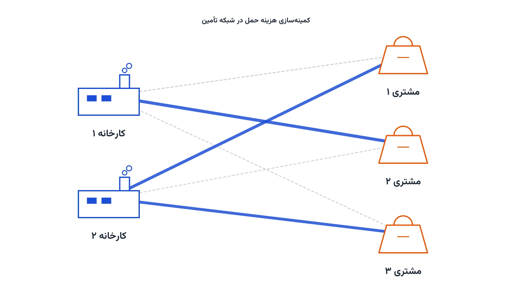

[Pyomo](https://www.pyomo.org/) یک کتابخانه متن‌باز پایتون برای مدل‌سازی ریاضی بهینه‌سازی است. با آن می‌توان مسائل برنامه‌ریزی خطی، عدد صحیح و غیرخطی را نوشت و با سالورهای مختلف حل کرد. این یادداشت، مرجع فارسی شما برای شروع کار با Pyomo است. محور اصلی آن یک مسئله کلاسیک و پرکاربرد به نام مسئله حمل‌ونقل یا Transportation Problem خواهد بود.

نصب Pyomo تنها با یک دستور ساده انجام می‌شود:

```bash
pip install pyomo
```

علاوه بر خود Pyomo، به یک سالور هم نیاز دارید. [CBC](https://github.com/coin-or/Cbc) و [HiGHS](https://highs.dev/) دو گزینه رایگان و قدرتمند برای مسائل خطی و عدد صحیح‌اند. نحوه نصب این سالورها را می‌توانید در یادداشت [سه روش عملی استفاده از Solverها در Pyomo](/notes/pyomo-solvers/) ببینید.

## ساختار پایه یک مدل در Pyomo

هر مدل Pyomo از چند بخش اصلی ساخته می‌شود: مجموعه‌ها، پارامترها، متغیرهای تصمیم، تابع هدف و قیدها. شیء اصلی برای ساخت مدل، `ConcreteModel` است.

```python
from pyomo.environ import *

model = ConcreteModel()
model.x = Var(within=NonNegativeReals)
model.obj = Objective(expr=model.x**2 - 4*model.x)

solver = SolverFactory('cbc')
solver.solve(model)

print(value(model.x))
```

این مثال فقط یک متغیر دارد. برای مسائل واقعی، معمولاً مجموعه‌ای از متغیرها روی اندیس‌های مختلف تعریف می‌شود. مسئله حمل‌ونقل دقیقاً همین ساختار اندیس‌دار را دارد و برای همین نقطه شروع خوبی برای یادگیری مدل‌سازی با Pyomo است.

## مسئله حمل‌ونقل: صورت مسئله

فرض کنید چند کارخانه کالا تولید می‌کنند و چند مشتری آن را سفارش داده‌اند. هر کارخانه ظرفیت تولید محدودی دارد و هر مشتری تقاضای مشخصی. هزینه حمل هر واحد کالا از هر کارخانه به هر مشتری هم از قبل معلوم است. هدف، پیداکردن ارزان‌ترین الگوی حمل است؛ الگویی که هم ظرفیت کارخانه‌ها را رعایت کند و هم تقاضای همه مشتریان را برآورده کند.

این مسئله یکی از قدیمی‌ترین و شناخته‌شده‌ترین مسائل برنامه‌ریزی خطی است. ساختار دوبخشی آن، یعنی کارخانه‌ها در یک سمت و مشتریان در سمت دیگر، آن را به پایه بسیاری از مدل‌های بزرگ‌تر زنجیره تأمین تبدیل کرده است. شرکتی مثل یونیلیور در توزیع جهانی محصولات مصرفی، هرروز با نسخه‌های بزرگ‌تر همین مسئله روبه‌رو است: کدام انبار به کدام فروشگاه کالا بفرستد تا هزینه کل حمل کمینه شود.

## فرمول‌بندی ریاضی

مجموعه کارخانه‌ها را $S$ و مجموعه مشتریان را $C$ می‌نامیم. ظرفیت کارخانه $s$ برابر $Supply_s$ و تقاضای مشتری $c$ برابر $Demand_c$ است. هزینه حمل هر واحد از $s$ به $c$ را $T_{c,s}$ می‌نامیم. متغیر تصمیم $x_{c,s}$ مقدار کالای حمل‌شده از کارخانه $s$ به مشتری $c$ است.

هدف مدل، کمینه‌کردن هزینه کل حمل است:

$$
\min \sum_{c \in C} \sum_{s \in S} T_{c,s} \, x_{c,s}
$$

قید ظرفیت تضمین می‌کند هیچ کارخانه‌ای بیش از توان تولیدش کالا نفرستد:

$$
\sum_{c \in C} x_{c,s} \le Supply_s \qquad \forall s \in S
$$

قید تقاضا هم تضمین می‌کند نیاز هر مشتری کامل تأمین شود:

$$
\sum_{s \in S} x_{c,s} \ge Demand_c \qquad \forall c \in C
$$



## پیاده‌سازی کامل در Pyomo

داده مسئله را می‌توان مستقیماً در کد یا از یک فایل CSV خواند. اینجا برای سادگی داده را مستقیم در کد تعریف می‌کنیم؛ برای مسائل بزرگ‌تر، خواندن همین پارامترها از یک فایل اکسل یا CSV با pandas کاملاً معمول است.

```python
from pyomo.environ import *

customers = ['customer1', 'customer2', 'customer3']
sources   = ['factory1', 'factory2']

supply = {'factory1': 350, 'factory2': 600}
demand = {'customer1': 300, 'customer2': 400, 'customer3': 150}

cost = {
    ('customer1', 'factory1'): 2.5, ('customer1', 'factory2'): 3.5,
    ('customer2', 'factory1'): 1.7, ('customer2', 'factory2'): 2.2,
    ('customer3', 'factory1'): 4.0, ('customer3', 'factory2'): 1.0,
}

model = ConcreteModel()
model.x = Var(customers, sources, domain=NonNegativeReals)

model.cost = Objective(
    expr=sum(cost[c, s] * model.x[c, s] for c in customers for s in sources),
    sense=minimize,
)

model.supply_con = ConstraintList()
for s in sources:
    model.supply_con.add(sum(model.x[c, s] for c in customers) <= supply[s])

model.demand_con = ConstraintList()
for c in customers:
    model.demand_con.add(sum(model.x[c, s] for s in sources) >= demand[c])

solver = SolverFactory('cbc')
solver.solve(model)

print(f"هزینه کل بهینه: {value(model.cost):.1f}")
for c in customers:
    for s in sources:
        qty = value(model.x[c, s])
        if qty > 1e-6:
            print(f"{s} -> {c}: {qty:.0f} واحد")
```

خروجی این مدل، دقیق‌ترین الگوی حمل را نشان می‌دهد: کدام کارخانه چه مقدار به کدام مشتری بفرستد. در این مثال کوچک، سالور معمولاً کارخانه ارزان‌تر برای هر مشتری را تا جای ممکن اشباع می‌کند و تنها در صورت لزوم سراغ کارخانه گران‌تر می‌رود. همین الگو را در تصویر بالا هم می‌بینید: بیشتر مسیرهای فعال، همان مسیرهای ارزان‌تر هستند و تعداد کمی از آن‌ها واقعاً استفاده می‌شوند.

## تحلیل حساسیت با متغیرهای دوگان

یکی از قابلیت‌های قدرتمند مدل‌های خطی، متغیرهای دوگان یا Dual Values است. این مقادیر نشان می‌دهند اگر ظرفیت یک کارخانه یا تقاضای یک مشتری یک واحد تغییر کند، هزینه کل بهینه چقدر تغییر می‌کند. به این مقدار، قیمت سایه یا Shadow Price هم گفته می‌شود.

برای فعال‌کردن این قابلیت در Pyomo، باید پیش از حل مدل یک `Suffix` اضافه کرد:

```python
model.dual = Suffix(direction=Suffix.IMPORT)
solver.solve(model)

for i, s in enumerate(sources, start=1):
    print(f"قیمت سایه ظرفیت {s}: {model.dual[model.supply_con[i]]:.2f}")
```

اگر قیمت سایه یک کارخانه صفر باشد، یعنی آن کارخانه ظرفیت اضافی دارد؛ افزایش ظرفیتش هزینه کل را کم نمی‌کند. اگر قیمت سایه مثبت باشد، یعنی آن کارخانه گلوگاه است و هر واحد ظرفیت اضافی در آن، هزینه کل را به همان مقدار کاهش می‌دهد. این تحلیل، ابزاری ارزشمند برای تصمیم‌گیری درباره سرمایه‌گذاری در ظرفیت است، بدون نیاز به حل دوباره مدل از صفر.

## نکات عملی

تعویض سالور در Pyomo فقط به تغییر یک رشته نیاز دارد. برای مسائل غیرخطی، `SolverFactory('ipopt')` به‌جای CBC استفاده می‌شود. برای مسائل بزرگ‌تر صنعتی، [HiGHS](https://highs.dev/) معمولاً سریع‌تر از CBC عمل می‌کند و رایگان هم هست.

وقتی داده واقعی از چند صد کارخانه و مشتری دارید، تعریف دستی دیکشنری `cost` دیگر عملی نیست. در این حالت، خواندن داده از یک فایل CSV با pandas و ساخت دیکشنری‌های پایتون از روی آن، راه استاندارد کار است. ستون‌های معمول چنین فایلی شامل نام مبدأ، نام مقصد، هزینه واحد، ظرفیت و تقاضا هستند.

## جمع‌بندی

مسئله حمل‌ونقل، نقطه شروع ایده‌آلی برای یادگیری Pyomo است: ساختار ساده دارد، فرمول‌بندی ریاضی‌اش شفاف است، و دقیقاً همان الگویی است که بسیاری از مسائل بزرگ‌تر زنجیره تأمین از آن ساخته می‌شوند. اگر می‌خواهید این مهارت‌ها را روی مسائل واقعی‌تر مثل مسیریابی ناوگان و شبکه توزیع تمرین کنید، دوره [بهینه‌سازی زنجیره تأمین و حمل‌ونقل با پایتون](/courses/vrp-python/) دقیقاً همین مسیر را دنبال می‌کند.

برای یادگیری عمیق‌تر خود زبان مدل‌سازی ریاضی، پیش از ورود به مسائل تخصصی‌تر، دوره [مدل‌سازی ریاضی و بهینه‌سازی با پایتون](/courses/optimization-modeling/) پایه محکمی می‌سازد.
