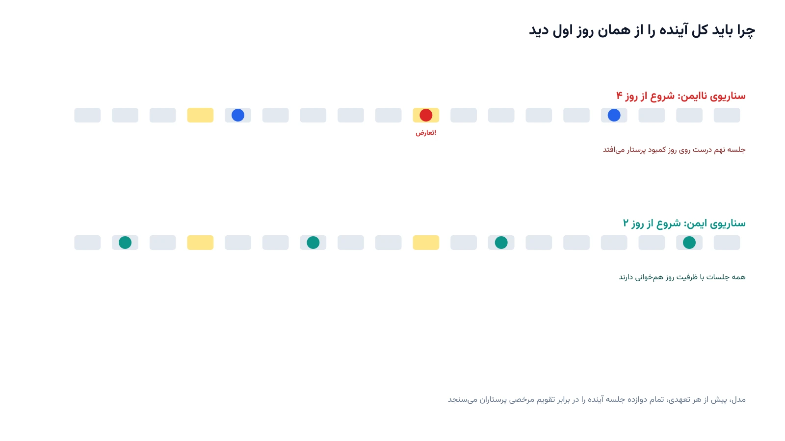

بیماری که تشخیص سرطان می‌گیرد، معمولاً یک سوال فوری دارد. «درمانم از کِی شروع می‌شود؟». پاسخ به این سوال، یک تعهد بلندمدت است. فرض کنید دوره درمان هر بیمار دقیقاً دوازده جلسه رادیوتراپی است. هر جلسه هم باید درست پنج روز بعد از جلسه قبلی برگزار شود. وقتی به بیمار می‌گوییم «از امروز شروع کن»، همه دوازده تاریخ او تا دو ماه آینده قطعی می‌شود. هیچ جلسه‌ای را نمی‌توان بعداً کنسل یا جابه‌جا کرد.

نکته‌ای این مسئله را حساس می‌کند، وجود پرستار است، نه دستگاه. هر روزی که بیمار باید بیاید، باید پرستاری هم برای پذیرش او حاضر باشد. هر پرستار در هر روز حداکثر بیست بیمار می‌تواند بپذیرد. بیمارستان هم هشت پرستار دارد. مشکل زمانی پیش می‌آید که مرخصی چند پرستار در یک روز خاص، با تاریخ جلسه چند بیمار متعهدشده هم‌زمان شود. چون کنسلی ممکن نیست، این تعارض باید پیش از تعهد به بیمار، از قبل کشف شود.

## فرمول‌بندی ریاضی مسئله

افق برنامه‌ریزی را روزهای $d = 1, \dots, H$ در نظر بگیرید. بیمارستان $N$ پرستار دارد و پارامتر $\text{avail}_{n,d}$ نشان می‌دهد پرستار $n$ در روز $d$ حاضر است یا در مرخصی. هر پرستار حاضر، حداکثر $A$ بیمار می‌پذیرد. پس ظرفیت پذیرش روز $d$ این‌طور محاسبه می‌شود.

$$
C_d = A \sum_{n=1}^{N} \text{avail}_{n,d}
$$

بیمارانی که پیش‌تر تاریخ شروعشان تثبیت شده، بار ثابتی روی تقویم ایجاد کرده‌اند. این بار را $L_d$ می‌نامیم؛ یعنی تعداد جلساتی که از بیماران قبلاً متعهدشده، دقیقاً در روز $d$ برگزار می‌شود. برای هر بیمار جدید $q$، یک متغیر دودویی $x_{q,s}$ تعریف می‌شود. این متغیر برابر یک است اگر روز $s$ به او پیشنهاد و تثبیت شود.

هر بیمار جدید باید دقیقاً یک روز شروع بگیرد.

$$
\sum_{s} x_{q,s} = 1 \quad \forall q
$$

مهم‌ترین قید، ظرفیت پذیرش در هر روز از کل افق است، با احتساب هم بار قبلی و هم بیماران جدید.

$$
L_d + \sum_{q} \sum_{k=0}^{11} x_{q,\, d-5k} \leq C_d \quad \forall d
$$

این قید دقیقاً همان چیزی است که بیمارستان به آن نیاز دارد. اگر بیمار $q$ از روز $s$ شروع کند، دوازده جلسه او روی روزهای $s, s+5, \dots, s+55$ می‌افتد. قید بالا تضمین می‌کند هیچ‌کدام از این دوازده روز، ظرفیت پذیرش پرستاران را نقض نکند. تابع هدف هم می‌تواند کمینه‌کردن مجموع فاصله شروع درمان تا روز آمادگی بیمار باشد. این‌طور، بیماران در اولین روز ممکن و امن شروع می‌کنند.

## چرا این موضوع مهم است

خطر اصلی، تصمیم‌گیری با افق دید محدود است. اگر فقط ظرفیت همین امروز را چک کنیم و به بیمار بگوییم شروع کند، ریسکی پنهان می‌ماند. ممکن است جلسه ششم او، شش هفته بعد، درست روی روزی بیفتد که سه پرستار همزمان مرخصی گرفته‌اند. چون قول شروع درمان دیگر قابل پس‌گرفتن نیست، این تعارض باید همان لحظه اول، برای تمام دوازده جلسه آینده، بررسی شود. حتی بیمارستان‌هایی با تجهیزات مدرن از شرکتی مثل Varian Medical Systems هم از این مشکل مصون نیستند. گلوگاه واقعی اینجا دستگاه نیست، ظرفیت پذیرش پرستاران است.

ارزش این مدل، جلوگیری از یک بحران آینده است، نه فقط بهینه‌سازی امروز. بیمارستان می‌تواند تقویم مرخصی پرستاران و بار قبلاً تثبیت‌شده بیماران را همزمان بررسی کند. با این کار، از همان روز اول فقط روزهای واقعاً امن به بیمار جدید پیشنهاد می‌شود. نتیجه، هم رعایت تعهد درمانی بدون هیچ کنسلی است، و هم برنامه‌ریزی منصفانه‌تر مرخصی پرستاران بدون گروگان‌گیری تاریخ‌های درمانی.

## ظرفیت پژوهشی و آکادمیک

این نسخه از زمان‌بندی رادیوتراپی، به‌خاطر قید بلندمدت و غیرقابل‌لغو بودن تعهد، مسیرهای پژوهشی جالبی دارد. یک جهت باز، مدل‌سازی عدم‌قطعیت در تقویم مرخصی پرستاران است. مرخصی اضطراری همیشه ممکن است بعد از تثبیت یک بیمار رخ دهد. مسیر دیگر، طراحی یک سیاست پذیرش پویا (Online Admission Control) است. چنین سیاستی باید بیماران را یکی‌یکی و بدون دیدن آینده بپذیرد، اما همچنان تضمین‌شدنی بماند.

جهت سوم، عدالت در تخصیص روزهای زودتر است. وقتی چند بیمار همزمان درخواست شروع می‌دهند، چه کسی باید روز زودتر را بگیرد؟ ترکیب این پرسش با معیارهای اولویت بالینی، پژوهش را به تقاطع بهینه‌سازی ترکیبیاتی و تخصیص منصفانه منابع می‌برد. این زمینه خوبی برای پایان‌نامه یا مقاله در تحقیق در عملیات سلامت است.

## پیاده‌سازی با پایتون

خبر خوب این است که این مدل، با وجود قید بلندمدت دوازده‌جلسه‌ای‌اش، ساختار سادگی دارد و به‌خوبی با ابزارهای متن‌باز و رایگان پایتون حل می‌شود. ماژول CP-SAT از کتابخانه [OR-Tools](https://developers.google.com/optimization) گوگل برای این کار مناسب است. کل مسئله فقط از متغیرهای دودویی و چند قید جمع خطی ساده تشکیل شده است.

در عمل، برای هر بیمار جدید و هر روز کاندید شروع، یک متغیر دودویی تعریف می‌شود. برای هر روز از افق برنامه‌ریزی هم یک قید نوشته می‌شود. این قید، مجموع بار قبلی و جلسات بیماران جدید را با ظرفیت همان روز مقایسه می‌کند. ظرفیت هر روز هم از پیش، از روی تقویم حضور پرستاران محاسبه شده است. سالور با کمینه‌کردن مجموع تأخیر شروع، زودترین روز امن را برای هر بیمار پیدا می‌کند. همین ساختار ساده، با افزودن اولویت بالینی یا پذیرش پویا، به‌سادگی قابل گسترش است. آشنایی بیشتر با زمان‌بندی پرستاران در دوره  [بهینه سازی سلامت با پایتون](/courses/health-opt/) هم آمده است.

## سوالات متداول

<h3>چرا این مدل به‌جای ظرفیت دستگاه، روی ظرفیت پرستاران تمرکز می‌کند؟</h3>

چون در این بیمارستان، پذیرش روزانه بیمار به حضور پرستار وابسته است، نه به تعداد دستگاه شتاب‌دهنده. هر پرستار حداکثر بیست بیمار در روز می‌پذیرد و مرخصی پرستاران می‌تواند ظرفیت روزانه را به‌طور موقت پایین بیاورد. دوره <a href="/courses/health-opt/" style="color:#2563EB; font-weight:bold;">بهینه‌سازی سیستم‌های سلامت با پایتون</a> این نوع مسائل ظرفیت پذیرش را با جزئیات بیشتری پوشش می‌دهد.

<h3>چرا نمی‌شود فقط ظرفیت همان روز شروع را بررسی کرد؟</h3>

چون وقتی بیمار شروع کند، تعهد به دوازده جلسه آینده او دیگر قابل لغو نیست. اگر فقط امروز را بررسی کنیم و جلسه هفتم او شش هفته بعد با کمبود پرستار برخورد کند، دیگر راه بازگشتی وجود ندارد. به همین دلیل، مدل باید هر دوازده تاریخ آینده را همان لحظه اول بررسی کند.

<h3>برای پیاده‌سازی این مدل با قوانین دقیق بیمارستان خودمان چه کار کنیم؟</h3>

هر بیمارستان تعداد پرستار، ظرفیت پذیرش روزانه و فاصله جلسات خودش را دارد. برای طراحی و پیاده‌سازی دقیق چنین مدلی متناسب با شرایط واقعی شما، می‌توانید از طریق <a href="/consultation/" style="color:#2563EB; font-weight:bold;">مشاوره</a> جزئیات کار را مطرح کنید.

