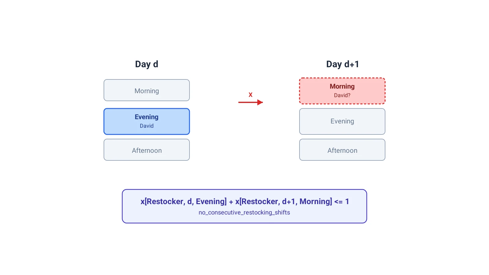

فرض کنید مدیر یک فروشگاه کوچک هستید. هر هفته باید جدول شیفت چهار کارمند را ببندید؛ هرکدام فقط برای یک یا دو نقش صلاحیت دارند، نقش صندوق‌دار و انباردار. هم باید همیشه یک صندوق‌دار سر کار باشد، هم انباردار بعد از شیفت شب بلافاصله شیفت صبح نگیرد، هم بار کاری بین همه عادلانه تقسیم شود. این دقیقاً همان مسئله‌ای است که در یادداشت [زمان‌بندی شیفت کارکنان با CP-SAT](/notes/employee-shift-scheduling-cp-sat/) هم با فرمول‌بندی دیگری دیدیم؛ این‌بار مدل را با متغیرهای بولیِ تودرتو و بر پایه‌ی نقش هر کارمند می‌سازیم، نه با یک اندیس خطی ساده.

## ساخت مدل خالی

هر مدل CP-SAT با یک شیء `CpModel` خالی شروع می‌شود. تمام متغیرها و قیدها بعداً به همین شیء اضافه می‌شوند.

```python
from ortools.sat.python import cp_model

model = cp_model.CpModel()
```

## داده‌های کارکنان، روزها، شیفت‌ها و نقش‌ها

ابتدا فهرست کارکنان را همراه با نقش‌هایی که هرکدام صلاحیتش را دارند مشخص می‌کنیم. هر کارمند می‌تواند یک یا دو نقش داشته باشد.

```python
employees = {"Phil": ["Restocker"],
             "Emma": ["Cashier", "Restocker"],
             "David": ["Cashier", "Restocker"],
             "Rebecca": ["Cashier"]}
```

برنامه یک هفته را پوشش می‌دهد و هر روز سه شیفت دارد؛ همچنین دو نقش در فروشگاه تعریف شده است.

```python
days = ["Monday",
        "Tuesday",
        "Wednesday",
        "Thursday",
        "Friday",
        "Saturday",
        "Sunday"]

shifts = ["Morning",
          "Afternoon",
          "Evening"]

roles = ["Cashier",
         "Restocker"]
```

## متغیرهای تصمیم

برای هر ترکیب از کارمند، نقش، روز و شیفت، یک متغیر بولی لازم داریم که نشان دهد آیا آن کارمند در آن نقش، آن روز، آن شیفت کار می‌کند یا نه. متغیر بولی متغیری است با دامنه‌ی $\{0,1\}$.

```python
schedule = {e:
             {r:
               {d:
                 {s: model.new_bool_var(f"schedule_{e}_{r}_{d}_{s}")
                   for s in shifts}
                 for d in days}
               for r in roles}
             for e in employees}
```

این چهار سطح تودرتو دقیقاً همان چهار بعد مسئله را نشان می‌دهند: کارمند، نقش، روز و شیفت. در ادامه، هر قید جدید فقط یک محدودیت از دنیای واقعی را به همین متغیرها اضافه می‌کند.

## قید پوشش صندوق‌دار

در هر لحظه باید دقیقاً یک صندوق‌دار سر کار باشد.

```python
for d in days:
    for s in shifts:
        model.add(sum(schedule[e]["Cashier"][d][s] for e in employees) == 1)
```

## قید پوشش انباردار

برای کار انبارداری، فقط یک شیفت در روز کافی است، نه در هر سه شیفت.

```python
for d in days:
    model.add(sum(schedule[e]["Restocker"][d][s] for e in employees for s in shifts) == 1)
```

## جلوگیری از شیفت شب و صبح پشت سر هم برای انباردار

با محدودکردن مجموع شیفت‌های انبارداریِ هر جفت شب-صبح متوالی به حداکثر یک، از خستگی انباشته جلوگیری می‌کنیم.

```python
for i in range(len(days)-1):
    model.add(sum(schedule[e]["Restocker"][days[i]]["Evening"] + schedule[e]["Restocker"][days[i+1]]["Morning"] for e in employees) <= 1)
```



## حداکثر یک نقش در هر شیفت

کارمندی که صلاحیت هر دو نقش را دارد، در یک شیفت فقط می‌تواند یکی از آن‌ها را انجام دهد، نه هر دو را هم‌زمان.

```python
for e in employees:
    for d in days:
        for s in shifts:
            model.add(sum(schedule[e][r][d][s] for r in roles) <= 1)
```

## رعایت صلاحیت نقش‌ها

برای جلوگیری از تخصیص کارمند به نقشی که صلاحیتش را ندارد، متغیر مربوطه را مستقیماً صفر می‌کنیم.

```python
for e in employees:
    for r in roles:
        for d in days:
            for s in shifts:
                if r not in employees[e]:
                    model.add(schedule[e][r][d][s] == 0)
```

## عدم همپوشانی شیفت صبح و عصر در یک روز

هر کارمند در یک روز، یا شیفت صبح می‌گیرد، یا شیفت عصر، یا هیچ‌کدام؛ هر دو با هم ممنوع است.

```python
for e in employees:
    for d in days:
        model.add(sum(schedule[e][r][d]["Morning"] + schedule[e][r][d]["Evening"] for r in roles) <= 1)
```

## حل مدل اولیه

با همین چند قید، می‌توانیم مدل را به یک سالور بسپاریم.

```python
solver = cp_model.CpSolver()

solver.solve(model)
```

## سقف ساعت کاری هفتگی

صاحب فروشگاه نمی‌خواهد دستمزد اضافه‌کاری بپردازد؛ پس هر کارمند حداکثر ۱۰ شیفت در هفته (معادل ۴۰ ساعت) کار می‌کند.

```python
for e in employees:
    model.add(sum(schedule[e][r][d][s] for r in roles for d in days for s in shifts) <= 10)
```

## قیود اختصاصی یک کارمند

گاهی یک کارمند شرایط خاص خودش را دارد. مثلاً فیل دانشجوی تمام‌وقت است و فقط می‌خواهد دقیقاً ۴ شیفت در هفته کار کند؛ همچنین نمی‌تواند شیفت صبح یا عصر روزهای هفته (نه آخر هفته) را بگیرد.

```python
model.add(sum(schedule["Phil"][r][d][s] for r in roles for d in days for s in shifts) == 4)

model.add(sum(schedule["Phil"][r][d][s] for r in roles for d in days if d not in ["Saturday", "Sunday"] for s in shifts if s in ["Morning", "Afternoon"]) == 0)
```

گاهی هم محدودیت بین دو کارمند است. فیل و اما با هم به‌خوبی کنار نمی‌آیند، پس نباید هم‌زمان در یک شیفت کار کنند.

```python
for d in days:
    for s in shifts:
        model.add(sum(schedule[e][r][d][s] for e in ["Phil", "Emma"] for r in roles) <= 1)
```

## توزیع یکسان شیفت‌های آخر هفته

برای عادلانه‌بودن، شیفت‌های شنبه و یکشنبه باید بین همه‌ی کارکنان به‌طور مساوی تقسیم شوند.

```python
for e in employees:
    model.add(sum(schedule[e][r][d][s] for r in roles for d in ["Saturday", "Sunday"] for s in shifts) == 2)
```

## درخواست مرخصی

اما می‌خواهد از دوشنبه تا جمعه مرخصی بگیرد. این درخواست را هم به‌شکل یک قید سخت می‌نویسیم.

```python
model.add(sum(schedule["Emma"][r][d][s] for r in roles for d in ["Monday", "Tuesday", "Wednesday", "Thursday", "Friday"] for s in shifts) == 0)
```

اگر بعداً نظرش عوض شود و فقط دوشنبه تا چهارشنبه را مرخصی بخواهد، کافی است همین قید را با بازه‌ی روزهای کوتاه‌تر دوباره بنویسیم.

```python
model.add(sum(schedule["Emma"][r][d][s] for r in roles for d in ["Monday", "Tuesday", "Wednesday"] for s in shifts) == 0)
```

## تابع هدف: عدالت در توزیع شیفت‌ها

تا اینجا همه‌ی قیود، قیدهای سخت بودند؛ هیچ تابع هدفی نداشتیم. برای اینکه بار کاری بین کارکنان تا حد امکان متعادل شود، ابتدا یک متغیر عدد صحیح برای تعداد کل شیفت‌های هر کارمند تعریف می‌کنیم.

```python
# total_shifts[e] indicates the number of shifts worked by employee `e`
total_shifts = {e: model.new_int_var(0, 10, f"total_shifts_{e}")
                for e in employees}

for e in employees:
    model.add(total_shifts[e] == sum(schedule[e][r][d][s] for r in roles for d in days for s in shifts))
```

سپس بیشترین و کمترین تعداد شیفت را در میان کارکنان (به‌جز فیل که پاره‌وقت است) پیدا می‌کنیم.

```python
min_shifts = model.new_int_var(0, 10, "min_shifts")
model.add_min_equality(min_shifts, [total_shifts[e] for e in employees if e != "Phil"])

max_shifts = model.new_int_var(0, 10, "max_shifts")
model.add_max_equality(max_shifts, [total_shifts[e] for e in employees if e != "Phil"])
```

در نهایت، تابع هدف فاصله‌ی بین پرکارترین و کم‌کارترین کارمند را کمینه می‌کند. هرچه این فاصله کوچک‌تر باشد، توزیع شیفت‌ها عادلانه‌تر است.

```python
model.minimize(max_shifts - min_shifts)
```

## جمع‌بندی

نکته‌ی جالب این مدل، نحوه‌ی ساخت تدریجی آن است. هر قید جدید، فقط یک جمله‌ی ساده به کد اضافه می‌کند؛ نه صلاحیت نقش، نه استراحت بین شیفت، نه حتی عدالت در تابع هدف، هیچ‌کدام مدل را پیچیده نمی‌کنند. این سبک ماژولار، دقیقاً همان مزیتی است که Constraint Programming را برای مسائل زمان‌بندی واقعی جذاب می‌کند؛ قیدها را یکی‌یکی اضافه می‌کنیم و سالور خودش راه حل سازگار با همه‌ی آن‌ها را پیدا می‌کند.

اگر دوست دارید این مدل را روی مسائل بزرگ‌تر یا با تابع هدف دیگری امتحان کنید، ساختار قیود پایه (پوشش، صلاحیت، استراحت، سقف ساعت) تقریباً بدون تغییر باقی می‌ماند؛ فقط داده‌های ورودی و تابع هدف عوض می‌شوند.

## سوالات متداول

<h3>چرا به‌جای یک متغیر ساده از دیکشنری تودرتو برای schedule استفاده شده؟</h3>
<p>چون مسئله چهار بعد دارد: کارمند، نقش، روز و شیفت. دیکشنری تودرتو خواناترین راه برای دسترسی به هر متغیر با نام مستقیم آن ابعاد است؛ در پروژه‌های بزرگ‌تر معمولاً از آرایه‌های NumPy یا pandas هم برای همین کار استفاده می‌شود.</p>

<h3>آیا می‌توان این مدل را با نسخه‌ی مبتنی‌بر متغیر بازه‌ای (Interval Variable) هم نوشت؟</h3>
<p>بله، وقتی شیفت‌ها طول متغیر داشته باشند یا بخواهیم زمان شروع دقیق را هم بهینه کنیم، مدل‌سازی با متغیر بازه‌ای و قید Cumulative مناسب‌تر است. یادداشت [آموزش کامل CP-SAT در OR-Tools](/notes/cpsat-scheduling-guide/) این رویکرد را با جزئیات بیشتر پوشش می‌دهد.</p>

<h3>برای یادگیری قدم‌به‌قدم این نوع مدل‌سازی از کجا شروع کنم؟</h3>
<p>دوره‌ی <a href="/courses/vrp-python/" style="color:#2563EB; font-weight:bold;">مسیریابی و بهینه‌سازی با پایتون</a> از همین مفاهیم پایه شروع می‌کند و در چند پروژه‌ی عملی، مدل‌سازی تخصیص و زمان‌بندی با CP-SAT را قدم‌به‌قدم آموزش می‌دهد.</p>
