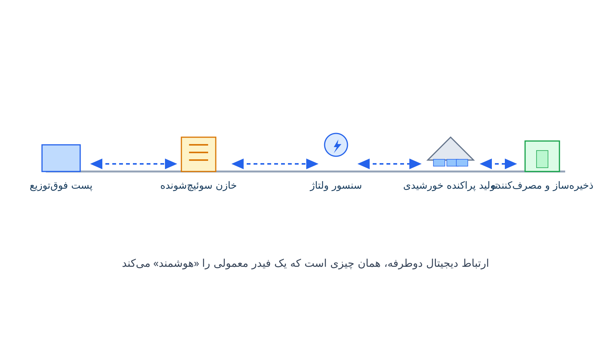

شبکه برق سنتی یک‌طرفه کار می‌کند. برق از نیروگاه به مصرف‌کننده جاری می‌شود، بدون بازخورد لحظه‌ای. اپراتور شبکه معمولاً وضعیت واقعی مصرف را با تأخیر می‌فهمد. شبکه هوشمند برق یا Smart Grid این معادله را عوض می‌کند. سنسورها، کنتورهای هوشمند و ارتباط دیجیتال دوطرفه به شبکه اضافه می‌شوند. این تغییر، شبکه را از یک مسیر ساده انتقال انرژی به یک سیستم قابل‌کنترل و بهینه‌سازی‌پذیر تبدیل می‌کند. دقیقاً همین‌جاست که تحقیق در عملیات و بهینه‌سازی ریاضی وارد ماجرا می‌شوند.

داده‌های لحظه‌ای کنتورهای هوشمند و سنسورهای شبکه، حجم زیادی اطلاعات تولید می‌کنند. این داده‌ها بدون یک چارچوب بهینه‌سازی، فقط عدد خام باقی می‌مانند. اما در یک مدل ریاضی، به تصمیم واقعی تبدیل می‌شوند. چه زمانی باتری شارژ شود؟ کدام مصرف‌کننده در ساعت پیک تشویق به کاهش مصرف شود؟ کدام خازن باید سوئیچ شود تا ولتاژ درست بماند؟ این یادداشت به فرمول‌بندی یکی از مسائل مرکزی شبکه هوشمند، یعنی کنترل ولتاژ و توان راکتیو، می‌پردازد.

## فرمول‌بندی ریاضی مسئله

نکته مهم درباره بهینه‌سازی شبکه هوشمند این است که تابع هدف همیشه یکی نیست. گاهی هدف کمینه‌کردن تلفات توان است. گاهی هدف نگه‌داشتن ولتاژ در بازه مجاز است. گاهی هم هدف رفع گرفتگی خطوط (Congestion) یا افزایش تاب‌آوری شبکه در برابر خرابی است. بسته به نیاز اپراتور، هر کدام از این‌ها می‌تواند تابع هدف اصلی یا یکی از جمله‌های یک تابع هدف ترکیبی باشد.

یکی از مسائل کلاسیک شبکه هوشمند، بهینه‌سازی ولتاژ و توان راکتیو یا Volt-VAR Optimization است. هدف رایج این مسئله، ترکیبی از کاهش تلفات و کنترل انحراف ولتاژ از مقدار مرجع است، نه فقط کمینه‌کردن تلفات به‌تنهایی. فرض کنید شبکه‌ای با مجموعه شین‌های $N$ و شاخه‌های $E$ داریم. متغیر $V_i$ ولتاژ شین $i$ است و $Q_i^{cap}$ توان راکتیو خازن‌های سوئیچ‌شونده در شین $i$ است. یک فرمول رایج برای تابع هدف به این صورت است:

$$
\min \; P_{loss} + \lambda_V \sum_{i \in N} \left| V_i - V_i^{ref} \right|
$$

$P_{loss}$ همان تلفات توان اکتیو کل شبکه است و جمله دوم، انحراف ولتاژ هر شین از مقدار مرجعش را با ضریب وزنی $\lambda_V$ جزیمه می‌کند. این تابع هدف باید همراه با چند قید اصلی حل شود:

$$
V_{min} \le V_i \le V_{max} \quad \forall i \in N
$$

$$
Q_i^{cap} \in \{Q_1, Q_2, \dots, Q_k\}, \qquad \sum_{j} P_{ij} - \sum_{k} P_{jk} = P_i^{load}
$$

قید اول، بازه ولتاژ مجاز هر شین را تحمیل می‌کند؛ معمولاً بین ۹۵ تا ۱۰۵ درصد ولتاژ نامی. قید دوم، گسسته‌بودن پله‌های خازن سوئیچ‌شونده را نشان می‌دهد. قید سوم، تعادل توان در هر شین است. چون $Q_i^{cap}$ گسسته است و معادلات پخش‌بار غیرخطی‌اند، این مسئله یک برنامه‌ریزی غیرخطی عدد صحیح مختلط (MINLP) است. در عمل، معمولاً با تقریب خطی یا الگوریتم فراابتکاری حل می‌شود. در مسائل دیگر شبکه هوشمند، همین ساختار قابل تغییر است؛ مثلاً به‌جای انحراف ولتاژ، می‌توان جمله‌ای برای هزینه گرفتگی خطوط یا جمله‌ای برای شاخص تاب‌آوری در برابر قطعی اضافه کرد.

## چرا این موضوع اهمیت دارد

نفوذ روزافزون خودروهای برقی و پنل‌های خورشیدی پشت‌بامی، شبکه توزیع را زیر فشار جدیدی برده است. جریان توان که قبلاً یک‌طرفه بود، حالا دوطرفه شده است. یک خانه ممکن است ساعتی مصرف‌کننده باشد و ساعتی دیگر تولیدکننده. بدون کنترل هوشمند، این نوسان می‌تواند ولتاژ شبکه را از بازه مجاز خارج کند. شرکت‌های توزیع برق در سراسر دنیا، از جمله ایران، با همین چالش روبه‌رو هستند.

شبکه هوشمند این چالش را به فرصت تبدیل می‌کند. با داده لحظه‌ای و بهینه‌سازی سریع، اپراتور می‌تواند بار را متعادل کند. باتری‌ها می‌توانند در زمان مناسب شارژ یا دشارژ شوند. مصرف‌کنندگان هم می‌توانند از طریق برنامه‌های پاسخ بار (Demand Response) در مدیریت پیک شرکت کنند. این هماهنگی، بدون مدل‌سازی ریاضی دقیق، عملاً ممکن نیست.

## مهم‌ترین شاخه‌های بهینه‌سازی در شبکه هوشمند برق

بهینه‌سازی شبکه هوشمند فقط به کنترل ولتاژ و توان راکتیو محدود نمی‌شود. پخش‌بار بهینه (Optimal Power Flow) یکی از پرکاربردترین ابزارهاست؛ خروجی توان اکتیو و راکتیو هر واحد را طوری تعیین می‌کند که هم قیدهای شبکه رعایت شود و هم هزینه یا تلفات کمینه بماند. تعهد واحدها (Unit Commitment) و نسخه امنیت‌محورش، هماهنگ با محدودیت‌های شبکه انتقال، تصمیم می‌گیرد کدام واحد در چه ساعتی روشن باشد. تخمین حالت شبکه (State Estimation) هم با پردازش داده‌های سنسورها، تصویر لحظه‌ای و قابل‌اعتمادی از وضعیت شبکه می‌سازد که پایه تصمیم‌های دیگر است.

در کنار این‌ها، برنامه‌ریزی توسعه شبکه توزیع و انتقال باید محل و زمان نصب فیدر، پست یا خط جدید را مشخص کند؛ در شبکه هوشمند، این تصمیم باید جایابی منابع تولید پراکنده و ذخیره‌سازها را هم در نظر بگیرد. کنترل فرکانس، به‌ویژه با نفوذ بالای تولید تجدیدپذیر متغیر، برای حفظ پایداری شبکه اهمیت بیشتری پیدا کرده است. پیش‌بینی بار، قیمت برق و تولید تجدیدپذیر هم ورودی ضروری همه این مدل‌هاست؛ بدون پیش‌بینی دقیق، حتی بهترین مدل بهینه‌سازی هم تصمیم قابل‌اعتمادی نمی‌دهد.

بازار برق و روش‌های تسویه آن (Market Clearing) هم بخشی از این تصویر است، مخصوصاً وقتی مصرف‌کنندگان خانگی با پنل خورشیدی یا باتری، خودشان به یک بازیگر کوچک بازار تبدیل می‌شوند. مدیریت عدم‌قطعیت تولید تجدیدپذیر، از طریق برنامه‌ریزی تصادفی یا بهینه‌سازی استوار، در تمام این شاخه‌ها حضور دارد؛ چون هرچه سهم خورشید و باد در شبکه بیشتر شود، پیش‌بینی‌ناپذیری هم بیشتر می‌شود.

## ظرفیت پژوهشی و آکادمیک

شبکه هوشمند برق یکی از پرتحرک‌ترین حوزه‌های پژوهشی مهندسی سیستم قدرت است. ترکیب بهینه‌سازی Volt-VAR با جایابی منابع تولید پراکنده، هنوز مسائل حل‌نشده زیادی دارد. مدل‌سازی عدم‌قطعیت تولید خورشیدی و بادی با رویکردهای استوار یا تصادفی، مسیر پژوهشی فعالی است. ترکیب یادگیری ماشین با بهینه‌سازی کلاسیک برای پیش‌بینی و کنترل لحظه‌ای هم روزبه‌روز مهم‌تر می‌شود. برای آشنایی با پایه ریاضی مسائل مشابه، یادداشت [بازآرایی شبکه توزیع](/notes/dist-reconfiguration/) نگاه نزدیکی به این حوزه دارد. دانشجویانی که به دنبال موضوع پایان‌نامه با کاربرد صنعتی روشن هستند، این حوزه گزینه بسیار مناسبی است.

## پیاده‌سازی با پایتون

برای پیاده‌سازی این مدل‌ها نیازی به نرم‌افزار تجاری گران‌قیمت نیست. کتابخانه [pandapower](https://www.pandapower.org/) امکان محاسبه پخش‌بار و بررسی قیدهای ولتاژ را آماده می‌دهد. برای فرمول‌بندی دقیق‌تر مسئله به‌صورت MINLP یا تقریب خطی آن، [Pyomo](https://www.pyomo.org/) گزینه مناسبی است. اگر می‌خواهید فرمول‌بندی پخش‌بار و کنترل ولتاژ را قدم‌به‌قدم و کاربردی یاد بگیرید، دوره [بهینه‌سازی پیشرفته سیستم قدرت](/courses/advanced-power-system/) دقیقاً همین موضوعات را با مثال عملی پوشش می‌دهد.

سالورهای متن‌باز مانند [HiGHS](https://highs.dev/) یا [CBC](https://github.com/coin-or/Cbc) برای بخش خطی‌شده مسئله کافی‌اند. با این ابزارهای رایگان، حتی یک شرکت توزیع کوچک می‌تواند مدل کنترل ولتاژ خودش را بدون هزینه لایسنس بسازد.

## سوالات متداول

<h3>آیا شبکه هوشمند فقط درباره کنتورهای هوشمند است؟</h3>

خیر. کنتور هوشمند فقط یک بخش از شبکه هوشمند است. شبکه هوشمند شامل سنسورها، ارتباط دیجیتال دوطرفه، اتوماسیون توزیع و الگوریتم‌های بهینه‌سازی برای کنترل لحظه‌ای شبکه هم می‌شود.

<h3>آیا این مدل‌ها فقط برای شبکه‌های بزرگ کاربرد دارند؟</h3>

خیر. حتی یک فیدر توزیع متوسط با چند خازن سوئیچ‌شونده هم از بهینه‌سازی Volt-VAR سود می‌برد. اندازه مدل کاملاً قابل تنظیم است.

<h3>برای یادگیری مدل‌سازی این مسائل از کجا شروع کنم؟</h3>

دوره <a href="/courses/advanced-power-system/" style="color:#2563EB; font-weight:bold;">سیستم قدرت پیشرفته</a> پایه محکمی برای فرمول‌بندی پخش‌بار و کنترل ولتاژ فراهم می‌کند و از مثال‌های ساده تا مسائل واقعی پیش می‌رود.

<h3>اگر بخواهم این مدل را برای شبکه واقعی خودم پیاده‌سازی کنم چه کار کنم؟</h3>

می‌توانید از طریق صفحه <a href="/consultation/" style="color:#2563EB; font-weight:bold;">مشاوره</a> جزئیات شبکه و داده‌هایتان را در میان بگذارید تا مدل متناسب با محدودیت‌های عملیاتی‌تان طراحی شود.

