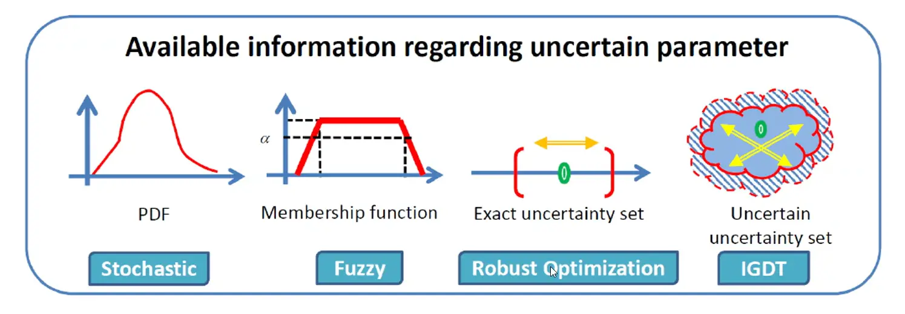

## مقدمه

هیچ تصمیمی در شبکه برق بر پایه اعداد قطعی گرفته نمی‌شود. میزان باری که فردا مصرف می‌شود، توان تولیدی مزرعه بادی در ساعت آینده، احتمال خروج ناگهانی یک ژنراتور، یا حتی قیمت سوخت در سال آینده — همه این‌ها اعدادی نامطمئن‌اند که باید در مدل‌های برنامه‌ریزی و بهره‌برداری شبکه لحاظ شوند. پرسش کلیدی این نیست که «آیا عدم‌قطعیت وجود دارد؟»، بلکه این است که «با چه ابزاری آن را در تصمیم‌گیری وارد کنیم؟».

پاسخ به این پرسش یک روش واحد ندارد. بسته به این‌که چه میزان اطلاعات از رفتار پارامتر نامطمئن در دست است — یک تابع توزیع احتمال کامل، یک تخمین فازی از کارشناس، یا حتی هیچ اطلاعات کمّی‌ای — ابزار مناسب برای مدل‌سازی آن پارامتر متفاوت خواهد بود. در ادامه، طبقه‌بندی کاربردی این ابزارها را مرور می‌کنیم.

## دو دسته پارامتر نامطمئن در سیستم قدرت

پارامترهای نامطمئنی که در مطالعات سیستم قدرت با آن‌ها روبه‌رو می‌شویم را می‌توان در دو دسته کلی جای داد.

دسته نخست پارامترهای فنی هستند که خود به دو زیرگروه تقسیم می‌شوند: پارامترهای توپولوژیک (مانند خروج اضطراری خطوط، ژنراتورها یا تجهیزات اندازه‌گیری) و پارامترهای عملیاتی (مانند مقدار لحظه‌ای بار یا تولید). دسته دوم پارامترهای اقتصادی هستند که در سطح خرد شامل هزینه سوخت، مالیات و دستمزد، و در سطح کلان شامل سیاست‌های تنظیم بازار، رشد اقتصادی و نرخ بهره می‌شوند. هر دو دسته می‌توانند به‌طور محسوسی نتیجه یک تصمیم بهینه‌سازی را تغییر دهند، و به همین دلیل نادیده‌گرفتن آن‌ها ریسک واقعی به همراه دارد.

## روش‌های مدل‌سازی عدم‌قطعیت

**رویکرد احتمالاتی.** در این روش، پارامترهای ورودی متغیرهای تصادفی با تابع چگالی احتمال (PDF) مشخص در نظر گرفته می‌شوند. سه ابزار رایج این رویکرد عبارت‌اند از شبیه‌سازی مونت‌کارلو که با نمونه‌گیری مکرر از توزیع پارامترها رفتار خروجی را برآورد می‌کند، روش تخمین نقطه‌ای که بر پایه گشتاورهای آماری با تعداد اجرای بسیار کمتر به نتیجه مشابهی می‌رسد، و تصمیم‌گیری مبتنی بر سناریو که در آن مجموعه‌ای از سناریوهای محتمل تولید و در صورت حجیم‌بودن، با تکنیک کاهش سناریو به زیرمجموعه‌ای کوچک و مدیریت‌پذیر تقلیل می‌یابد.

*فرمول‌بندی ریاضی — تصمیم‌گیری مبتنی بر سناریو:*

$$
y = \sum_{s\in\Omega_J} \pi_s \times f(Z_s), \qquad \sum_{s\in\Omega_J}\pi_s = 1
$$

**رویکرد فازی.** وقتی داده‌های آماری کافی برای ساختن یک PDF در دست نیست ولی کارشناسان می‌توانند رفتار یک پارامتر را با یک تابع عضویت فازی توصیف کنند، این رویکرد به کار می‌آید. با روش «α-cut» می‌توان برای هر سطح از اطمینان، کران بالا و پایین خروجی مدل را محاسبه کرد و در پایان با غیرفازی‌سازی، یک عدد قطعی برای تصمیم‌گیری به دست آورد.

*فرمول‌بندی ریاضی:* برای یک مجموعه فازی $\tilde{A}$ در $U$، مجموعه قطعی $A^{\alpha}$ شامل تمام عناصری از $U$ است که درجه عضویتشان از $\alpha$ بیشتر یا مساوی باشد:

$$
A^{\alpha} = \{x\in U \mid \mu_A(x) \ge \alpha\}, \qquad A^{\alpha} = (\underline{A}^{\alpha}, \bar{A}^{\alpha})
$$

با محاسبه α-cut هر پارامتر ورودی، $X^{\alpha}$، کران‌های خروجی به‌صورت زیر به دست می‌آید:

$$
y^{\alpha} = \left(\min_{X^\alpha} f(X^\alpha),\ \max_{X^\alpha} f(X^\alpha)\right)
$$

**رویکرد ترکیبی فازی-احتمالاتی.** در بسیاری از مسائل واقعی، برخی پارامترها آماری و برخی دیگر فازی هستند. این رویکرد دو روش قبلی را با هم ترکیب می‌کند — مثلاً مونت‌کارلو را با تحلیل α-cut، یا مدل مبتنی بر سناریو را با پارامترهای فازی — تا هر دو نوع عدم‌قطعیت هم‌زمان لحاظ شوند.

*فرمول‌بندی ریاضی — ترکیب سناریو با α-cut:*

$$
\underline{y}^{\alpha} = \min \sum_{s\in\Omega_s}\pi_s\times f(Z_s, X^\alpha), \qquad \bar{y}^{\alpha} = \max \sum_{s\in\Omega_s}\pi_s\times f(Z_s, X^\alpha)
$$

**نظریه تصمیم‌گیری شکاف اطلاعاتی (IGDT).** گاهی حتی داده کافی برای ساختن یک تابع عضویت فازی هم وجود ندارد؛ تنها یک پیش‌بینی نقطه‌ای از پارامتر در دست است بدون هیچ اطلاعاتی از میزان خطای احتمالی آن. IGDT در این شرایط به‌جای بهینه‌سازی صرف تابع هدف، به‌دنبال تصمیمی می‌گردد که بیشترین «مقاومت» را در برابر انحراف پیش‌بینی از واقعیت داشته باشد — یعنی بیشترین میزان خطای مجاز که همچنان یک قید حیاتی را نقض نکند.

*فرمول‌بندی ریاضی:* مجموعه عدم‌قطعیت پارامتر $x$ حول مقدار پیش‌بینی‌شده $\tilde{x}$ با سطح عدم‌قطعیت $\alpha$ تعریف می‌شود:

$$
U(\alpha,\tilde{x}) = \left\{x : \left|\frac{x-\tilde{x}}{\tilde{x}}\right| \le \alpha\right\}
$$

مقاومت تصمیم $\bar{d}$ نسبت به الزام $\zeta$، بیشینه مقدار $\alpha$ است که در آن قید هدف هنوز نقض نمی‌شود:

$$
\hat{\alpha}(\bar{d},\zeta) = \max\ \alpha \quad \text{s.t. Constraints}
$$

و مسئله نهایی تصمیم‌گیری به‌صورت زیر است:

$$
\max_{\bar{d}} \hat{\alpha}(\bar{d},\zeta) \quad \text{s.t.}\quad \forall x\in U(\alpha,\tilde{x}):\ f(x,\bar{d})\le\zeta,\ H(x,\bar{d})=0,\ G(x,\bar{d})\ge 0
$$

**بهینه‌سازی مقاوم (Robust Optimization).** عدم‌قطعیت با یک «مجموعه عدم‌قطعیت» تعریف می‌شود و راه‌حل باید برای بدترین حالت ممکن در آن مجموعه نیز بهینه/شدنی بماند. با گرفتن دوگان زیرمسئله بدترین‌حالت، فرم نهایی به یک مسئله خطی و قابل‌حل تبدیل می‌شود:

$$
\begin{aligned}
\max_{y,\xi_i,\beta} \quad & z \\
\text{s.t.} \quad 
& z \le f(x,z) \\
& f(x,y) = A(y)\bar{x} + g(y) - \Gamma\beta - \sum_i \xi_i \\
& \beta + \xi_i \ge A(y_i)\hat{x}_i \\
& \sum_i w_i \le \Gamma
\end{aligned}
$$

##  کدام متد مناسب است؟

این ابزارها طیف وسیعی از مسائل واقعی سیستم قدرت را پوشش می‌دهند: ارزیابی اثر تولید پراکنده و خودروهای الکتریکی قابل‌شارژ بر شبکه، برآورد ظرفیت انتقال در دسترس، برنامه‌ریزی و بهره‌برداری منابع تجدیدپذیر، پخش بار احتمالاتی و فازی، ارزیابی قابلیت اطمینان، برنامه‌ریزی شبکه توزیع و انتقال، خودزمان‌بندی نیروگاه‌ها، دیسپچ اقتصادی پویا، تخمین حالت، و استراتژی‌های مزایده و تامین انرژی در بازار برق. تقریباً هر مسئله بهینه‌سازی سیستم قدرت که با داده واقعی سروکار داشته باشد، دیر یا زود به یکی از این ابزارها نیاز پیدا می‌کند.

## چطور روش درست را انتخاب کنیم؟

نکته مهمی که در عمل کمتر به آن توجه می‌شود این است که هیچ‌کدام از این روش‌ها به‌طور مطلق «بهتر» از بقیه نیست؛ انتخاب درست، تابع میزان و نوع اطلاعاتی است که واقعاً در اختیار داریم. اگر داده تاریخی کافی برای برازش یک توزیع آماری معتبر وجود دارد، رویکرد احتمالاتی طبیعی‌ترین انتخاب است. اگر تنها قضاوت کارشناسی در دسترس است، رویکرد فازی مناسب‌تر می‌نشیند. اگر حتی همان قضاوت کارشناسی هم به‌سختی قابل کمّی‌سازی است، IGDT و بهینه‌سازی مقاوم راه‌حل‌هایی هستند که به‌جای «حدس زدن» توزیع، تصمیم را در برابر بدترین حالت محافظت می‌کنند. انتخاب اشتباه ابزار — مثلاً فرض یک PDF دقیق برای پارامتری که اصلاً داده کافی پشت آن نیست — می‌تواند نتیجه مدل را به‌شدت گمراه‌کننده کند، حتی اگر خود مدل بهینه‌سازی از نظر ریاضی کاملاً درست باشد.

## جمع‌بندی

مدل‌سازی عدم‌قطعیت صرفاً یک لایه فنی اضافه به مسائل بهینه‌سازی سیستم قدرت نیست؛ در بسیاری از تصمیم‌های واقعی — از برنامه‌ریزی سرمایه‌گذاری تا بهره‌برداری روزانه شبکه — نادیده‌گرفتن عدم‌قطعیت می‌تواند تفاوت میان یک برنامه قابل‌اجرا و یک برنامه شکننده باشد. شناخت طیف کامل ابزارهای موجود، به پژوهشگر این امکان را می‌دهد تا برای هر مسئله، ابزار متناسب با واقعیت داده‌های در دسترس را انتخاب کند، نه اینکه یک ابزار را به‌صورت پیش‌فرض و بدون توجیه برای همه شرایط به‌کار ببرد.

## سوالات متداول

<h3>از کجا بدانم کدام روش عدم‌قطعیت برای مسئله من مناسب است؟</h3>

معیار اصلی، نوع اطلاعاتی است که از پارامتر نامطمئن در دست دارید: داده آماری کافی به سمت رویکرد احتمالاتی می‌رود، قضاوت کارشناسی به سمت رویکرد فازی، و نبود هیچ اطلاعات کمّی به سمت IGDT یا بهینه‌سازی مقاوم. هنوز شک دارید کدام‌یک برای مسئله شما مناسب‌تر است؟ <a href="/consultation/" class="content-link">مشاوره بگیرید</a>.

<h3>آیا این روش‌ها با پایتون قابل پیاده‌سازی‌اند؟</h3>

بله. شبیه‌سازی مونت‌کارلو، تحلیل سناریو، بهینه‌سازی مقاوم و IGDT همگی با ابزارهایی مانند Pyomo و solverهای رایگان در پایتون قابل مدل‌سازی و حل هستند.

<h3>این مبحث به چه دوره‌ای مرتبط است؟</h3>

این موضوع بخشی از مجموعه مباحث پیشرفته بهینه‌سازی سیستم قدرت است و مستقیماً به دوره <a href="/courses/advanced-power-system/" class="content-link">بهینه‌سازی پیشرفته سیستم قدرت</a> مرتبط است؛ جایی که علاوه بر مدل‌های قطعی مانند پخش بار بهینه و برنامه‌ریزی توسعه شبکه، نحوه وارد‌کردن عدم‌قطعیت در همین مدل‌ها نیز به‌صورت پروژه‌محور آموزش داده می‌شود.

