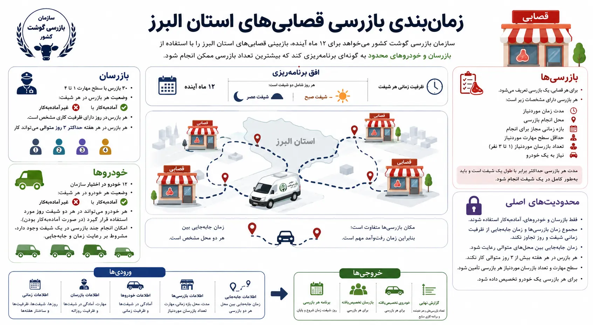
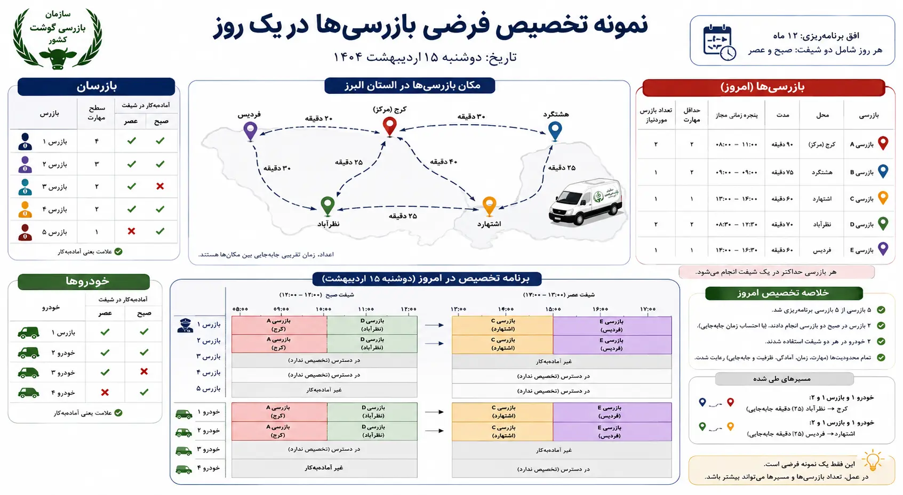

## شرح مسئله

فرض کنید **سازمان بازرسی گوشت کشور** قصد دارد برای بازبینی و کنترل قصابی‌های **استان البرز** در طول یک سال برنامه‌ریزی کند.

در سطح استان، تعداد زیادی واحد صنفی وجود دارد که باید در بازه‌های زمانی مشخص مورد بازرسی قرار گیرند. برای انجام هر بازرسی، سازمان باید تعدادی بازرس با سطح مهارت مناسب و یک خودرو در اختیار داشته باشد.

مسئله اصلی این است که تعداد بازرسان و خودروها محدود است و همه آن‌ها نیز در تمام روزهای سال آماده‌به‌کار نیستند. از طرف دیگر، قصابی‌ها در نقاط مختلف استان قرار دارند و رفت‌وآمد بین آن‌ها نیز بخشی از زمان کاری را مصرف می‌کند.

هدف این است که برای ۱۲ ماه آینده برنامه‌ای تهیه شود که مشخص کند **هر بازرسی در چه روز و شیفتی، توسط چه بازرسانی و با کدام خودرو انجام شود**؛ به‌گونه‌ای که بیشترین تعداد بازرسی ممکن انجام شود و تمام محدودیت‌های عملیاتی رعایت شوند.

---

## افق برنامه‌ریزی

افق برنامه‌ریزی ۱۲ ماه آینده است.

هر روز شامل دو شیفت است:

- شیفت صبح
- شیفت عصر

هر شیفت دارای ظرفیت زمانی مشخصی است.

یک بازرسی ممکن است تمام یک شیفت را اشغال کند یا تنها بخشی از آن را نیاز داشته باشد. بنابراین در صورت کافی بودن زمان، امکان انجام چند بازرسی در یک شیفت وجود دارد.

---

## بازرسی‌ها

هر قصابی که نیاز به بازبینی دارد، به‌صورت یک **بازرسی** در سیستم تعریف می‌شود.

برای هر بازرسی اطلاعات زیر مشخص است:

- مدت زمان موردنیاز برای بازرسی
- محل انجام بازرسی
- بازه زمانی مجاز برای انجام آن
- حداقل سطح مهارت موردنیاز
- تعداد بازرسان موردنیاز
- نیاز به یک خودرو

مدت هر بازرسی حداکثر برابر با یک شیفت است و هر بازرسی باید به‌طور کامل در یک شیفت انجام شود.

هر بازرسی بین ۱ تا ۳ بازرس نیاز دارد و تمام بازرسانی که به آن تخصیص داده می‌شوند باید حداقل سطح مهارت لازم را داشته باشند.

---

## بازرسان

سازمان ۳۰ بازرس در اختیار دارد.

سطح مهارت هر بازرس بین ۱ تا ۴ است.

برای هر بازرس و در هر شیفت مشخص است که آیا **آماده‌به‌کار** است یا خیر:

- `1` : آماده‌به‌کار
- `0` : غیرآماده‌به‌کار

تنها بازرسان آماده‌به‌کار می‌توانند در آن شیفت به یک یا چند بازرسی تخصیص داده شوند.

هر بازرس دارای ظرفیت زمانی مشخصی در روز است و مجموع زمان بازرسی‌ها و جابه‌جایی‌های او نباید از ظرفیت کاری مجاز بیشتر شود.

همچنین هر بازرس در هر هفته حداکثر می‌تواند **۳ روز متوالی** کار کند.

این محدودیت در ابتدای هر هفته مجدداً محاسبه می‌شود و سابقه روزهای کاری متوالی هفته قبل به هفته جدید منتقل نمی‌شود.

اگر یک بازرس در یک روز حداقل یک بازرسی انجام دهد، آن روز برای او یک روز کاری محسوب می‌شود.

---

## خودروها

سازمان ۱۲ خودرو برای جابه‌جایی تیم‌های بازرسی در اختیار دارد.

برای هر خودرو و هر شیفت نیز وضعیت آماده‌به‌کار بودن مشخص است:

- `1` : آماده‌به‌کار
- `0` : غیرآماده‌به‌کار

فقط خودروهای آماده‌به‌کار می‌توانند به بازرسی‌ها تخصیص داده شوند.

هر خودرو می‌تواند در هر دو شیفت یک روز مورد استفاده قرار گیرد، به شرط آنکه در هر شیفت آماده‌به‌کار باشد.

یک خودرو نیز می‌تواند در یک شیفت برای چند بازرسی استفاده شود، مشروط بر اینکه مجموع زمان انجام بازرسی‌ها و جابه‌جایی میان آن‌ها از ظرفیت زمانی شیفت بیشتر نشود.

---

## مکان بازرسی‌ها و زمان جابه‌جایی

قصابی‌ها در نقاط مختلف استان قرار دارند و محل انجام همه بازرسی‌ها یکسان نیست.

بنابراین صرفاً جمع مدت زمان بازرسی‌ها برای تشخیص امکان انجام چند بازرسی در یک شیفت کافی نیست.

برای هر دو محل، زمان جابه‌جایی بین آن‌ها مشخص است.

اگر یک بازرس یا خودرو در یک شیفت چند بازرسی انجام دهد، باید علاوه بر مدت خود بازرسی‌ها، زمان لازم برای حرکت از محل یک بازرسی به محل بازرسی بعدی نیز در برنامه لحاظ شود.

در نتیجه، امکان انجام چند بازرسی در یک شیفت به این عوامل وابسته است:

- مدت بازرسی‌ها
- محل بازرسی‌ها
- زمان جابه‌جایی میان آن‌ها
- ترتیب انجام بازرسی‌ها
- ظرفیت زمانی شیفت

اگر دو بازرسی از نظر مکانی به‌اندازه‌ای از یکدیگر فاصله داشته باشند که انجام هر دو به همراه زمان جابه‌جایی در یک شیفت امکان‌پذیر نباشد، نمی‌توان آن‌ها را به یک بازرس یا یک خودرو در همان شیفت تخصیص داد.

---

## هماهنگی بازرس و خودرو

هر بازرسی باید در یک زمان مشخص توسط تمام منابع موردنیاز آن انجام شود.

بنابراین برای هر بازرسی باید هم‌زمان:

- تعداد کافی بازرس آماده‌به‌کار وجود داشته باشد
- سطح مهارت بازرسان کافی باشد
- یک خودروی آماده‌به‌کار وجود داشته باشد
- ظرفیت زمانی تمام منابع کافی باشد

زمان شروع و پایان یک بازرسی برای تمام بازرسان و خودروی تخصیص‌یافته به آن یکسان است.

اگر یک منبع در همان شیفت چند بازرسی انجام دهد، ترتیب این بازرسی‌ها نیز باید از نظر زمانی و مکانی قابل اجرا باشد.

---

## محدودیت‌های اصلی

برنامه نهایی باید شرایط زیر را رعایت کند:

- هر بازرسی حداکثر یک بار انجام شود.
- هر بازرسی در پنجره زمانی مجاز خود انجام شود.
- هر بازرسی به‌طور کامل در یک شیفت انجام شود.
- مدت هر بازرسی از ظرفیت یک شیفت بیشتر نباشد.
- تعداد بازرسان موردنیاز هر بازرسی تأمین شود.
- سطح مهارت بازرسان با نیاز بازرسی سازگار باشد.
- برای هر بازرسی یک خودرو در نظر گرفته شود.
- فقط بازرسان آماده‌به‌کار استفاده شوند.
- فقط خودروهای آماده‌به‌کار استفاده شوند.
- تداخل زمانی میان تخصیص‌های یک منبع وجود نداشته باشد.
- زمان جابه‌جایی میان بازرسی‌های متوالی رعایت شود.
- مجموع زمان بازرسی‌ها و جابه‌جایی‌ها از ظرفیت زمانی منبع بیشتر نشود.
- هر بازرس در هر هفته بیش از ۳ روز متوالی کار نکند.

---

## هدف مسئله

هدف، تهیه برنامه‌ای است که با منابع موجود و با رعایت محدودیت‌های زمانی، مکانی و نیروی انسانی، **بیشترین تعداد بازرسی را در افق ۱۲ ماهه انجام دهد**.

خروجی نهایی باید مشخص کند هر بازرسی:

- در چه روزی انجام می‌شود
- در کدام شیفت انجام می‌شود
- چه ساعتی شروع و تمام می‌شود
- توسط چه بازرسانی انجام می‌شود
- با کدام خودرو انجام می‌شود
- و در صورتی که یک منبع چند بازرسی در یک شیفت داشته باشد، ترتیب انجام آن‌ها چگونه است

---

## ورودی‌های مسئله

### اطلاعات زمانی

- تعداد روزهای افق برنامه‌ریزی
- شیفت‌های هر روز
- ظرفیت زمانی هر شیفت
- ساختار هفته‌ها

### اطلاعات بازرسان

برای هر بازرس:

- شناسه بازرس
- سطح مهارت
- وضعیت آماده‌به‌کار بودن در هر شیفت
- ظرفیت کاری روزانه

### اطلاعات خودروها

برای هر خودرو:

- شناسه خودرو
- وضعیت آماده‌به‌کار بودن در هر شیفت
- ظرفیت زمانی قابل استفاده

### اطلاعات بازرسی‌ها

برای هر بازرسی:

- شناسه بازرسی
- مدت زمان انجام
- مکان
- پنجره زمانی مجاز
- حداقل سطح مهارت موردنیاز
- تعداد بازرسان موردنیاز

### اطلاعات جابه‌جایی

- زمان جابه‌جایی بین مکان هر دو بازرسی

---

## خروجی‌های مسئله

برنامه نهایی باید برای هر بازرسی انتخاب‌شده مشخص کند:

- روز انجام
- شیفت انجام
- زمان شروع
- زمان پایان
- بازرسان تخصیص‌یافته
- خودروی تخصیص‌یافته

همچنین برای هر بازرس و خودرو باید **ترتیب بازرسی‌های انجام‌شده در هر شیفت** مشخص باشد.

در پایان نیز باید مشخص شود:

- چه تعداد بازرسی برنامه‌ریزی شده‌اند
- چه بازرسی‌هایی برنامه‌ریزی نشده‌اند
- برنامه کاری هر بازرس چیست
- برنامه استفاده از هر خودرو چیست

اگر می‌خواهید مدل‌سازی و حل کامل را در Python با OR-Tools قدم‌به‌قدم یاد بگیرید، این موضوع در <a href="/courses/vrp-python/" class="content-link">دوره بهینه‌سازی حمل و نقل </a> به‌صورت پروژه‌محور پوشش داده شده است.
