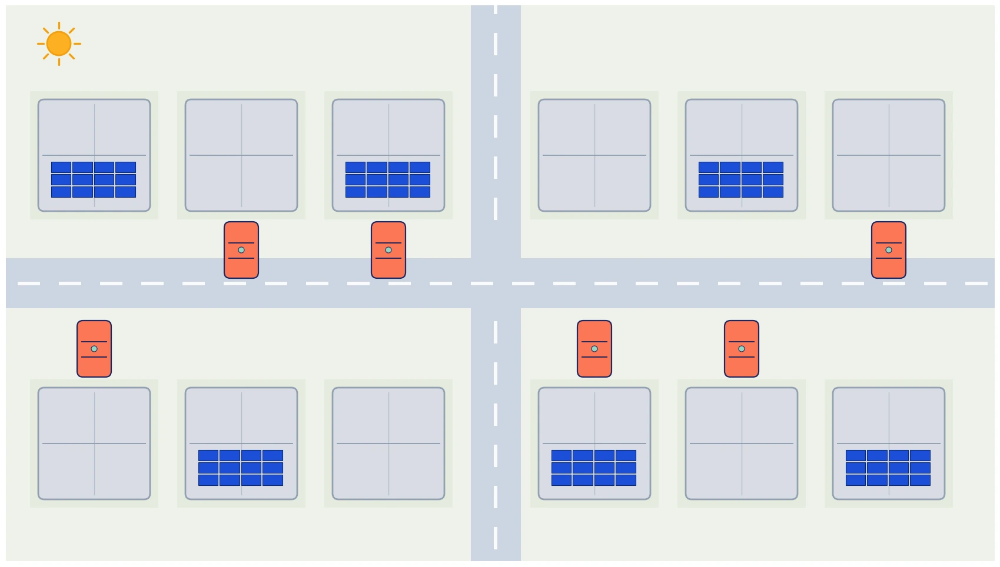

## 📋 معرفی پروژه

**هدف:** طراحی برنامه‌ی بهینه‌ی دیسپچ متمرکز منابع پراکنده‌ی یک شهرک مسکونی برای:

- ✅ هماهنگی شارژ خودروی الکتریکی و باتری خانگی به‌جای شارژ ناهماهنگ و هم‌زمان
- ✅ استفاده‌ی حداکثری از تولید پنل خورشیدی پیش از خرید از شبکه
- ✅ فعال‌سازی امن قابلیت تزریق انرژی خودرو به خانه/شبکه (V2G) بدون ایجاد پیک بازگشتی
- ✅ رعایت محدودیت واقعی ظرفیت فیدر/ترانسفورماتور محلی در تمام ساعات
- ✅ کاهش هزینه‌ی کل خرید برق شهرک در افق زمانی چندساله

اگر با مبانی مدل‌سازی ریاضی مسائل بهینه‌سازی آشنا نیستید،
دوره [مدل‌سازی مسائل بهینه‌سازی](/courses/optimization-modeling/) پیش‌زمینه‌ی خوبی می‌دهد.

تصویر بالا سه نمونه از خانه‌های این شهرک را نشان می‌دهد: خانه‌ی بدون تجهیزات، خانه‌ی دارای پنل خورشیدی روی
پشت‌بام، و خانه‌ای که هم پنل خورشیدی دارد و هم خودروی الکتریکی در پارکینگ. هر خانه مصرف، و در صورت وجود، تولید سولار و خودروی الکتریکی خودش را دارد؛
باتری خانگی و باتری مشترک شهرکی دو دارایی انعطاف‌پذیرند، و خودروهای دارای V2G می‌توانند در ساعات پیک انرژی
ذخیره‌شده‌ی خود را به خانه یا شبکه برگردانند. تمام این تبادل‌ها زیر یک سقف مشترک قرار دارند: ظرفیت فیدری که کل
شهرک را به شبکه‌ی بالادستی وصل می‌کند.



هر مربع در تصویر بالا یک خانه است: خانه‌هایی با شبکه‌ی آبی روی پشت‌بام پنل خورشیدی دارند، و خانه‌هایی با خودروی
نارنجی جلوی درب، صاحب خودروی الکتریکی‌اند — برخی از خانه‌ها هر دو را دارند و برخی هیچ‌کدام را، دقیقاً همان تنوعی که
مدل باید با آن کار کند.

---

## 🎯 ۱۰ تحویل پروژه

### **تحویل ۱: مدل‌سازی ریاضی سیستم و تدوین مسئله**

**اهداف:**

- تعریف ریاضی مسئله‌ی بهینه‌سازی سطح شهرک
- مشخص کردن متغیرهای تصمیم، تابع هدف و قیود برای هر خانه و برای کل شهرک
- تفکیک منابع خانگی (سولار، باتری، EV) از منابع مشترک شهرکی (باتری مشترک، فیدر)

**خروجی:**

- گزارش مدل ریاضی
- فرمول‌بندی موازنه‌ی انرژی هر خانه و هر بازه‌ی زمانی
- فرمول‌بندی دینامیک ذخیره‌سازها (SOC باتری خانگی، باتری مشترک، و باتری خودرو)

---

### **تحویل ۲: جمع‌آوری و پردازش داده‌ها**

**اهداف:**

- جمع‌آوری یا تولید پروفایل‌های ساعتی قیمت شبکه (Time-of-Use)، تولید سولار، و بار مصرفی هر خانه
- تعیین مشخصات فنی و الگوی حضور/غیبت خودروهای برقی (ظرفیت باتری، توان شارژ/دشارژ، ساعات در دسترس‌بودن)

**خروجی:**

- فایل داده شامل: پروفایل قیمت شبکه، پروفایل تولید سولار به ازای هر کیلووات‌پیک، بار ساعتی هر خانه، مشخصات و
  دسترس‌پذیری هر خودرو
- نمودارهای توصیفی منابع و تقاضا

---

### **تحویل ۳: کدنویسی مدل بهره‌برداری پایه (Baseline)**

**اهداف:**

- پیاده‌سازی قاعده‌ی شارژ بدون هماهنگی و بدون بهینه‌سازی، به‌عنوان خط پایه‌ی مقایسه
- سنجش هزینه‌ی هفتگی و پیک تقاضای شهرک در نبود هرگونه هماهنگی مرکزی

**خروجی:**

```python
# کد پایتون:
# - قاعده: هر خودرو هر زمان که در خانه و زیر سطح هدف است، با حداکثر توان شارژ می‌شود
# - بدون سیگنال قیمتی، بدون V2G
# - خروجی: هزینه‌ی هفتگی کل شهرک و پیک تقاضای ساعتی
```

- کد کامل + نتایج baseline
- ساعت وقوع و اندازه‌ی پیک تقاضا در سناریوی مبنا (نقطه‌ی مرجع برای مقایسه)

---

### **تحویل ۴: مدل‌سازی باتری خانگی، باتری مشترک، و خودروی الکتریکی با V2G**

**اهداف:**

- اضافه‌کردن متغیرهای باتری خانگی و باتری مشترک شهرکی (شارژ/دشارژ/SOC)
- اضافه‌کردن متغیرهای خودروی الکتریکی شامل دشارژ به خانه/شبکه (V2G)، با محدودیت پنجره‌ی زمانی حضور خودرو

**خروجی:**

```python
# متغیرهای جدید (نمونه):
m.soc_batt[i, t]             # سطح شارژ باتری خانگی خانه‌ی i
m.soc_ev[i, t]                # سطح شارژ خودروی خانه‌ی i
m.p_ev_charge[i, t], m.p_ev_discharge[i, t]
m.avail[i, t]                 # پارامتر صفر/یک بودن خودرو در خانه
```

- قیود: حد SOC، بازده شارژ/دشارژ، حداقل SOC تضمینی پیش از ساعت خروج خودرو، موازنه‌ی انرژی هر خانه
- کد اولیه با تحلیل قیود

---

### **تحویل ۵: تدوین هدف (Objective Function) و محدودیت فیدر**

**اهداف:**

- تعریف اجزای هدف: کمینه‌سازی هزینه‌ی خالص خرید برق شهرک از شبکه
- افزودن محدودیت سخت ظرفیت فیدر/ترانسفورماتور محلی به مجموع تبادل شهرک با شبکه‌ی بالادستی

**خروجی:**

- فرمول ریاضی تابع هدف: $\sum_t \left[\pi^{buy}_t \sum_i g^{buy}_{i,t} - \pi^{sell}_t \sum_i g^{sell}_{i,t}\right]$
- فرمول‌بندی محدودیت فیدر: $\sum_i g^{buy}_{i,t} - \sum_i g^{sell}_{i,t} \leq C^{feeder}\ \forall t$
- بحث در مورد trade-off بین هزینه، راحتی مالکان خودرو، و فشار به شبکه‌ی محلی

---

### **تحویل ۶: حل مسئله برای یک بازه‌ی کوتاه (Test Case)**

**اهداف:**

- اجرای مدل روی یک بازه‌ی کوتاه (یک هفته) و یک نمونه‌ی کوچک از خانه‌ها
- تصحیح خطاهای منطقی و بررسی معقول‌بودن رفتار باتری‌ها و خودروها
- مقایسه‌ی نتایج هماهنگ‌شده با سناریوی پایه‌ی تحویل ۳

**خروجی:**

```python
# نتایج:
# - برنامه‌ی ساعتی شارژ/دشارژ هر باتری و هر خودرو
# - مقایسه‌ی هزینه و پیک تقاضا با سناریوی baseline
```

- نمودارهای dispatch ساعتی و سطح SOC
- مقایسه‌ی کمّی با baseline (هزینه و پیک)

---

### **تحویل ۷: گسترش به مقیاس شهرک (۷۵ خانه)**

**اهداف:**

- تعمیم مدل از نمونه‌ی کوچک به مقیاس کامل شهرک (۷۵ خانه، ۳۰ خانه‌ی دارای سولار، ۲۵ خانه‌ی دارای خودروی الکتریکی)
- بررسی مقیاس‌پذیری مدل (تعداد متغیر، زمان حل) و در صورت نیاز ساده‌سازی یا تجزیه‌ی مسئله

**خروجی:**

- گزارش کوتاه درباره‌ی مقیاس‌پذیری و زمان حل در مقیاس کامل
- مدل آماده‌ی اجرا روی داده‌ی واقعی مشتری با همین ساختار

---

### **تحویل ۸: دیسپچ متمرکز — بهینه‌سازی هماهنگ در برابر سناریوی ناهماهنگ**

**اهداف:**

- حل مدل بهینه‌سازی مرکزی (دیسپچ متمرکز) که همه‌ی خانه‌ها، باتری‌ها و خودروها را هم‌زمان و زیر یک محدودیت فیدر
  مشترک هماهنگ می‌کند
- مقایسه‌ی این نتیجه با نسخه‌ی V2G ناهماهنگ (rule-based) که در آن هر خانه مستقل تصمیم می‌گیرد

**خروجی:**

- جواب بهینه‌ی دیسپچ متمرکز: برنامه‌ی ساعتی هر خانه بدون عبور از ظرفیت فیدر در هیچ ساعتی
- گزارش کمّی: میزان صرفه‌جویی هزینه و میزان کنترل پیک تقاضا نسبت به هر دو سناریوی baseline و V2G ناهماهنگ

---

### **تحویل ۹: تحلیل سناریو و حساسیت**

**اهداف:**

- بررسی نتایج در سناریوهای مختلف:
    - افزایش نفوذ خودروی الکتریکی و پنل خورشیدی در شهرک
    - تغییر ظرفیت فیدر (شبیه‌سازی شهرک با زیرساخت قدیمی‌تر یا جدیدتر)
    - تغییر سهم خودروهای دارای قابلیت V2G

**خروجی:**

- جداول تحلیل حساسیت
- نمودارهای اثر متغیرهای کلیدی بر هزینه و پیک تقاضا
- منحنی موازنه‌ی هزینه در برابر ظرفیت فیدر مورد نیاز
- توصیه‌های برنامه‌ریزی برای توسعه‌دهندگان شهرک و شرکت‌های توزیع برق

---

### **تحویل ۱۰: گزارش نهایی و ارائه**

**اهداف:**

- خلاصه‌ی تمام یافته‌ها از سناریوی پایه تا دیسپچ متمرکز
- توصیه‌های عملی برای هماهنگی شارژ در شهرک‌های با نفوذ بالای خودروی الکتریکی
- جمع‌بندی اثر دیسپچ متمرکز بر کاهش پیک تقاضا و به‌تعویق‌افتادن نیاز به ارتقای فیدر

**خروجی:**

- گزارش نهایی ۱۰ صفحه‌ای
- ارائه و اسلایدهای خلاصه
- کد کامل با مستندات
- فایل‌های داده و نتایج

---

## 📊 نتایج انتظاری

پس از تکمیل پروژه، باید بتوانید:

✅ مسئله‌ی هماهنگی منابع پراکنده‌ی یک شهرک مسکونی را به شکل ریاضی فرموله کنید
✅ کد پایتون برای مدل بهره‌برداری پایه و مدل دیسپچ متمرکز تولید کنید
✅ قابلیت V2G را به‌شکلی امن و با در نظر گرفتن نیاز مالک خودرو مدل‌سازی کنید
✅ محدودیت واقعی ظرفیت فیدر را در مدل لحاظ کنید و اثر آن را تفسیر کنید
✅ نتایج هماهنگ و ناهماهنگ را مقایسه کنید و میزان صرفه‌جویی و کنترل پیک را کمّی گزارش دهید
✅ گزارش حرفه‌ای و ارائه‌ی قابل قبول برای توسعه‌دهندگان شهرک یا شرکت‌های توزیع برق تدوین کنید

---

## 📁 فایل‌های پروژه

| تحویل | فایل                                     | توضیح                                          |
|-------|-------------------------------------------|-------------------------------------------------|
| ۱     | `model_formulation.pdf`                   | مدل ریاضی کامل                                  |
| ۲     | `system_data.xlsx`                        | قیمت شبکه، تولید سولار، بار هر خانه، مشخصات EV  |
| ۳     | `baseline_dispatch.py`                    | کد baseline بدون هماهنگی و بدون V2G             |
| ۴-۶   | `battery_ev_model_v*.py`                  | نسخه‌های مختلف مدل عملیاتی با باتری و V2G       |
| ۷-۸   | `centralized_dispatch_model.py`           | مدل دیسپچ متمرکز با قید ظرفیت فیدر              |
| ۹     | `sensitivity_analysis.py`                 | تحلیل حساسیت، شامل منحنی هزینه-ظرفیت فیدر       |
| ۱۰    | `final_report.docx` + `presentation.pptx` | گزارش و ارائه‌ی نهایی                           |

---

## 🚀 شروع کار

پیش از شروع کدنویسی، مرور یادداشت [مدل‌سازی ریاضی و اهمیت آن](/notes/mathematical-modeling-art/) کمک می‌کند مسئله را
درست فرموله کنید. برای اجرای کد بدون نصب چیزی روی سیستم خودتان، راهنمای [Google Colab](/notes/google-colab/) و برای
انتخاب سالور مناسب، یادداشت [سه روش عملی استفاده از سالورها در Pyomo](/notes/pyomo-solvers/) را ببینید. اگر می‌خواهید
عدم‌قطعیت تولید خورشیدی یا الگوی رفت‌وآمد خودرو را هم صریح در مدل وارد کنید، دوره
[مدل‌سازی عدم‌قطعیت](/courses/uncertainty-modeling/) ابزار لازم را می‌دهد.

## سوالات متداول

<h3>آیا برای این پروژه لازم است پیش‌زمینه‌ی قوی در سیستم قدرت داشته باشم؟</h3>
<p>نه لزوماً؛ آنچه بیشتر لازم است آشنایی با مفاهیم پایه‌ی برنامه‌ریزی خطی و مختلط-عدد صحیح است. در دوره <a href="/courses/power-systems-optimization/" style="color:#2563EB; font-weight:bold;">بهینه‌سازی سیستم قدرت</a> این مفاهیم از پایه و با مثال‌های عملی روی پایتون آموزش داده می‌شوند تا کسی که پیش‌زمینه‌ی بهینه‌سازی دارد هم بتواند وارد این حوزه شود.</p>

<h3>آیا نیاز به دانش تخصصی در حوزه‌ی خودروی الکتریکی یا باتری دارم؟</h3>
<p>نه؛ در این پروژه خودرو و باتری با مدل ساده‌ی ظرفیت-توان-بازده مدل می‌شوند و جزئیات شیمیایی یا سخت‌افزاری باتری وارد مدل نمی‌شوند. تمرکز پروژه روی جنبه‌ی بهینه‌سازی سیستمی و هماهنگی زمانی است، نه طراحی فنی باتری یا شارژر.</p>

<h3>محدودیت ظرفیت فیدر چطور در مدل لحاظ می‌شود؟</h3>
<p>با تعریف یک سقف ثابت (یا ساعتی) برای مجموع تبادل توان کل شهرک با شبکه‌ی بالادستی، و افزودن آن به‌عنوان یک قید سخت به مدل بهینه‌سازی. در تحویل ۸ این نتیجه با یک سناریوی V2G ناهماهنگ مقایسه می‌شود تا نشان داده شود صرفِ افزودن قابلیت V2G، بدون این محدودیت و بدون هماهنگی مرکزی، می‌تواند پیک تقاضا را بدتر کند نه بهتر.</p>
