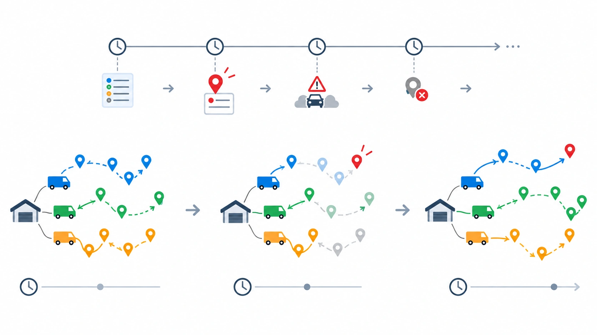

## 📋 معرفی پروژه

**هدف:** طراحی یک سیستم مسیریابی پویا برای ناوگان توزیع که بتواند:

- ✅ سفارش‌های جدید را در حین اجرای مسیر بپذیرد
- ✅ فقط بخش باقی‌مانده هر مسیر را اصلاح کند، نه کل برنامه را
- ✅ زمان پاسخ‌دهی را در حد چند ثانیه نگه دارد
- ✅ پایداری مسیرهای در حال اجرا را حفظ کند

اگر با مبانی مدل‌سازی ریاضی مسائل مسیریابی آشنا نیستید،
دوره [مسیریابی وسایل نقلیه با پایتون](/courses/vrp-python/) پیش‌زمینه‌ی خوبی می‌دهد.

تصویر بالا نمونه‌ای ساده از یک ناوگان را نشان می‌دهد؛ بخش خاکستری مسیر قفل‌شده و طی‌شده است، و بخش آبی
مسیر باقی‌مانده پس از درج سفارش جدید است.

هر شرکت توزیعی که مسیرهای روزانه را از قبل برنامه‌ریزی می‌کند، دیر یا زود با سفارش فوری میان‌روز روبه‌رو می‌شود.
مسئله این است که کل برنامه از نو حل نشود، بلکه فقط بخش باقی‌مانده هر مسیر، با کمترین اختلال ممکن، اصلاح شود.
این پروژه دقیقاً همین موتور بازبرنامه‌ریزی زمان‌واقعی را از صفر تا حل واقعی روی یک ناوگان بزرگ‌مقیاس می‌سازد.

---

## 🎯 ۱۰ تحویل پروژه

### **تحویل ۱: مدل‌سازی ریاضی مسئله و معماری رویداد-محور**

**اهداف:**

- تعریف ریاضی مسئله VRP استاتیک پایه
- طراحی معماری رویداد-محور برای رسیدن داده جدید
- تجزیه‌تحلیل ادبیات پروژه

**خروجی:**

- گزارش مدل ریاضی ۵ صفحه‌ای
- فرمول‌بندی دقیق قیود ظرفیت، پنجره زمانی و توالی مسیر
- نمودار معماری رویدادها (سفارش جدید، لغو، تأخیر)

---

### **تحویل ۲: شبیه‌سازی جریان سفارش‌های پویا**

**اهداف:**

- تولید جریان تصادفی سفارش‌های ورودی در طول روز
- تعریف سناریوهای مختلف نرخ ورود سفارش

**خروجی:**

- فایل داده شامل: موقعیت مشتریان، زمان رسیدن سفارش، ظرفیت درخواستی
- نمودارهای توصیفی نرخ ورود سفارش در طول شیفت کاری

---

### **تحویل ۳: کدنویسی مدل پایه VRP استاتیک (Baseline)**

**اهداف:**

- پیاده‌سازی مسئله VRP کلاسیک بدون رویداد پویا
- تعیین سناریوی بیس برای مقایسه

**خروجی:**

- کد کامل + نتایج baseline
- نقشه مسیرهای اولیه ناوگان

---

### **تحویل ۴: موتور رویداد و قفل مسیر (Route Locking)**

**اهداف:**

- پیاده‌سازی مکانیزم قفل‌کردن بخش طی‌شده مسیر
- تعیین نقطه شروع جدید هر مسیر بر اساس موقعیت فعلی خودرو

**خروجی:**

- منطق قفل مسیر با تحلیل قیود
- کد اولیه موتور رویداد

---

### **تحویل ۵: الگوریتم درج سریع سفارش جدید**

**اهداف:**

- پیاده‌سازی الگوریتم درج ارزان (Cheapest Insertion)
- محاسبه هزینه افزوده هر گزینه درج

**خروجی:**

- فرمول ریاضی تابع هزینه درج
- کد الگوریتم درج و انتخاب بهترین موقعیت
- مقایسه با حل کامل مسئله

---

### **تحویل ۶: حل مسئله برای ناوگان کوچک (Test Case)**

**اهداف:**

- اجرای مدل روی یک ناوگان کوچک و ساده (۳ تا ۵ خودرو)
- تصحیح خطاهای منطقی و اجرایی

**خروجی:**

- جداول و نمودارهای نتایج
- مقایسه با baseline

---

### **تحویل ۷: بهبود سرعت با جست‌وجوی محلی**

**اهداف:**

- اضافه‌کردن حرکات جست‌وجوی محلی (۲-opt، Relocate)
- تنظیم محدودیت زمانی پاسخ‌دهی سالور

**خروجی:**

- بررسی زمان حل قبل و بعد از بهبود
- تحلیل حساسیت روی پارامترهای جست‌وجو
- گزارش بهبودهای اعمال‌شده

---

### **تحویل ۸: حل برای ناوگان و مقیاس واقعی**

**اهداف:**

- اجرای مدل روی ناوگانی با ده‌ها خودرو و صدها مشتری
- مقابله با مسائل محاسباتی مقیاس بزرگ

**خروجی:**

- نتایج مسیریابی پویا برای ناوگان بزرگ
- مانده بهینگی نسبت به حل کامل
- گزارش عملکرد زمانی سیستم

---

### **تحویل ۹: تحلیل سناریوها و حساسیت**

**اهداف:**

- بررسی نتایج در سناریوهای مختلف:
    - نرخ‌های متفاوت ورود سفارش جدید
    - تغییر اندازه ناوگان
    - تأثیر سخت‌گیری پنجره‌های زمانی

**خروجی:**

- جداول تحلیل حساسیت
- نمودارهای اثر متغیرهای کلیدی
- توصیه‌های عملیاتی برای بهره‌برداری

---

### **تحویل ۱۰: گزارش نهایی و ارائه**

**اهداف:**

- خلاصه تمام یافته‌ها
- توصیه‌های عملی برای استقرار سیستم
- راهکارهای توسعه آینده

**خروجی:**

- گزارش نهایی ۱۰ صفحه‌ای
- ارائه و اسلایدهای خلاصه
- کد کامل با مستندات
- فایل‌های داده و نتایج

---

## 📊 نتایج انتظاری

پس از تکمیل پروژه، باید بتوانی:

✅ مسئله مسیریابی پویا را به شکل ریاضی فرموله کنی  
✅ کد OR-Tools برای موتور رویداد و درج سریع سفارش تولید کنی  
✅ جریان داده‌های زنده سفارش را پردازش و آنالیز کنی  
✅ نتایج را تفسیر کنی و توصیه‌های عملیاتی ارائه دهی  
✅ گزارش حرفه‌ای و ارائه‌ی قابل قبول برای صنعت تدوین کنی

---

## 📁 فایل‌های پروژه

| تحویل | فایل                                     | توضیح                              |
|-------|------------------------------------------|-------------------------------------|
| ۱     | `model_formulation.pdf`                  | مدل ریاضی کامل                      |
| ۲     | `order_stream_data.xlsx`                 | داده‌های شبیه‌سازی‌شده سفارش‌ها       |
| ۳     | `baseline_vrp.py`                        | کد baseline بدون رویداد پویا        |
| ۴-۸   | `dynamic_reopt_v*.py`                    | نسخه‌های مختلف کد                   |
| ۹     | `sensitivity_analysis.py`                | تحلیل حساسیت                        |
| ۱۰    | `final_report.pdf` + `presentation.pptx` | گزارش و ارائه                       |

---

## 🚀 شروع کار

۱. **مطالعه ادبیات:** جستجو برای مقالات درباره Dynamic Vehicle Routing Problem
۲. **انتخاب کتابخانه:** از [OR-Tools](https://developers.google.com/optimization) برای هسته حل مسئله استفاده کن

پیش از شروع کدنویسی، مرور یادداشت [مسیریابی وابسته به زمان](/notes/time-dependent-vrp/) کمک می‌کند مسئله را
درست فرموله کنید. اگر می‌خواهید فراتر از سناریوهای قطعی بروید و عدم‌قطعیت زمان رسیدن سفارش‌ها را هم صریح در مدل وارد کنید،
دوره [مدل‌سازی عدم‌قطعیت](/courses/uncertainty-modeling/) ابزار لازم را می‌دهد.

## سوالات متداول

<h3>آیا برای این پروژه لازم است پیش‌زمینه‌ی قوی در مسیریابی داشته باشم؟</h3>

نه لزوماً؛ آنچه بیشتر لازم است آشنایی با مفاهیم پایه‌ی برنامه‌ریزی خطی و مختلط‌عدد صحیح است. در دوره <a href="/courses/vrp-python/" style="color:#2563EB; font-weight:bold;">مسیریابی وسایل نقلیه با پایتون</a> این مفاهیم از پایه و با مثال‌های عملی روی پایتون آموزش داده می‌شوند تا کسی که پیش‌زمینه‌ی بهینه‌سازی دارد هم بتواند وارد این حوزه شود.

<h3>این پروژه چه تفاوتی با یک پروژه مسیریابی استاتیک معمولی دارد؟</h3>

پروژه‌های مسیریابی معمولی فقط یک‌بار حل می‌شوند و ثابت می‌مانند. این پروژه یک موتور رویداد-محور اضافه می‌کند که با هر سفارش جدید، فقط مسیر باقی‌مانده را اصلاح می‌کند، نه کل برنامه را.

<h3>برای مشاوره روی پیاده‌سازی این پروژه در سازمان خودم چه کار کنم؟</h3>

اگر روی استقرار یک سیستم مسیریابی پویای واقعی در ناوگان یا کسب‌وکار خودتان کار می‌کنید، می‌توانید از طریق صفحه <a href="/consultation/" style="color:#2563EB; font-weight:bold;">مشاوره</a> با ما در ارتباط باشید.

