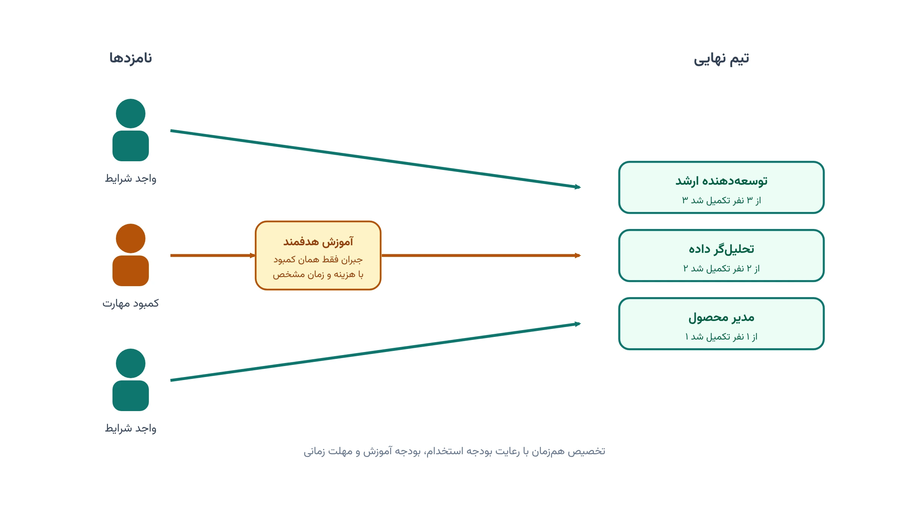
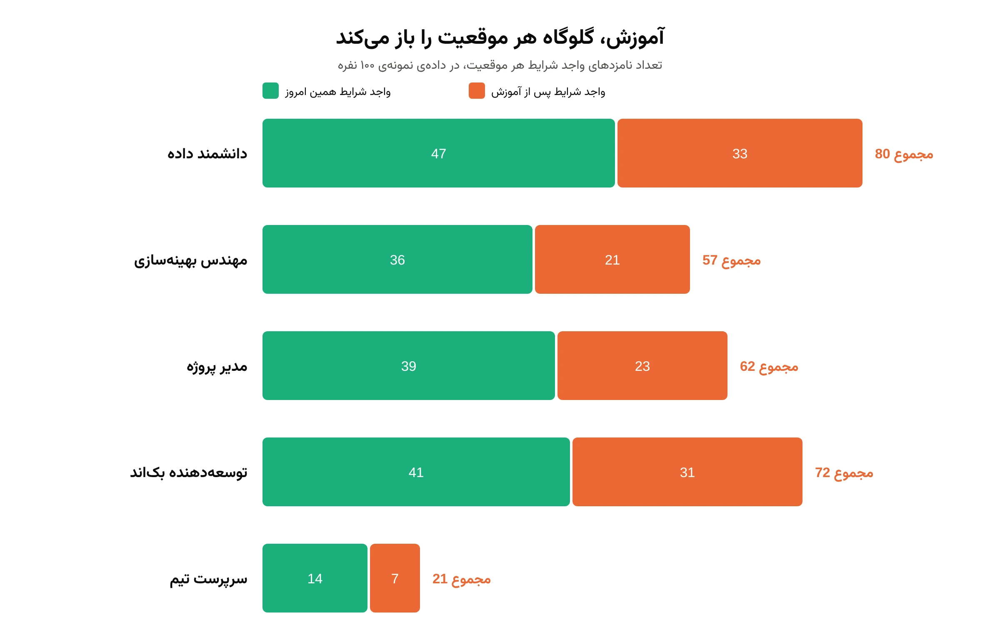
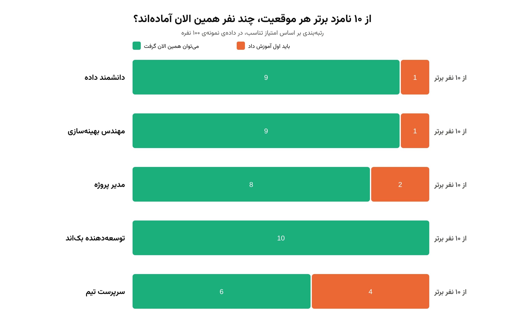
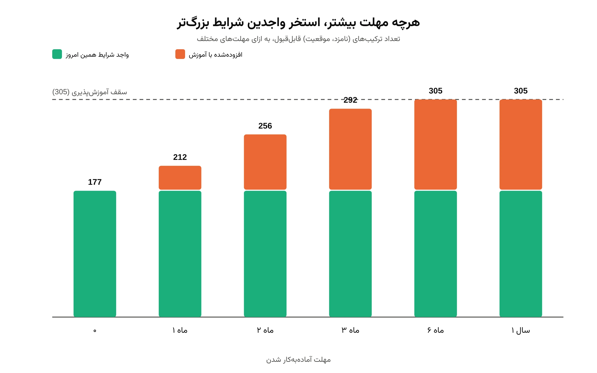
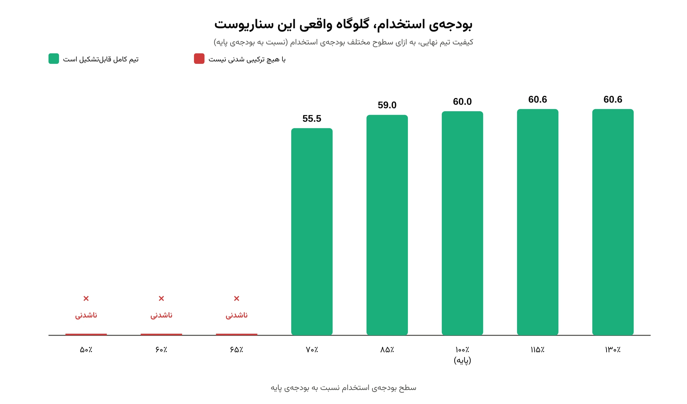

## 📋 معرفی پروژه

**هدف:** طراحی یک مدل تصمیم‌گیری برای واحد منابع انسانی سازمان شما که:

- ✅ بهترین ترکیب نامزدها را برای هر موقعیت شغلی باز تعیین کند
- ✅ کمبود مهارتی هر نامزد را با یک برنامه‌ی آموزشی مشخص (چه مهارتی، چند واحد، چند هفته، چه هزینه‌ای) جبران کند
- ✅ همزمان به بودجه‌ی استخدام، بودجه‌ی آموزش و مهلت زمانی آماده‌به‌کار شدن افراد پایبند بماند
- ✅ مشخص کند کدام محدودیت — بودجه یا زمان — در عمل تیم‌سازی شما را عقب نگه می‌دارد
- ✅ برای هر موقعیت، فهرست نفرات ذخیره را هم در اختیارتان بگذارد

اگر با مبانی مدل‌سازی ریاضی این‌گونه مسائل تخصیص آشنا نیستید، دوره
[مدل‌سازی مسائل بهینه‌سازی](/courses/optimization-modeling/) پیش‌زمینه‌ی خوبی می‌دهد.

نمونه‌ای مشابه از همین رویکرد تخصیص بهینه، در یادداشت
[زمان‌بندی شیفت کارکنان با CP-SAT](/notes/employee-shift-scheduling-cp-sat/) قابل مشاهده است.

تصویر بالا منطق اصلی کار را نشان می‌دهد. برخی نامزدها همین امروز واجد شرایط یک موقعیت‌اند و مستقیم تخصیص
می‌یابند. برخی دیگر در یک یا دو مهارت کمبود دارند. اما اگر هزینه و زمان آموزش آن کمبود در بودجه و مهلت شما
بگنجد، باز هم بهترین گزینه برای آن موقعیت می‌مانند.

هر سازمانی که هم‌زمان چند موقعیت شغلی باز دارد، دیر یا زود با همین معضل روبه‌رو می‌شود. نامزدی که دقیقاً همه‌ی
شرایط را دارد، معمولاً حقوق بالاتری می‌خواهد یا اصلاً در دسترس نیست. حذف خودکار نامزدهای «تقریباً مناسب» از
فهرست هم، فرصت‌های واقعی را از بین می‌برد. تصمیم درست، تصمیمی است که به تطابق فعلی بسنده نمی‌کند. هزینه و زمان لازم برای رساندن هر نامزد به حد استاندارد
را هم در محاسبه وارد می‌کند. این دقیقاً همان کاری است که این پروژه برای تیم شما انجام می‌دهد. مدلی که حقوق،
هزینه‌ی آموزش، سرعت آماده‌شدن و کیفیت نهایی تیم را با هم می‌سنجد.

---

## 🧩 ابعاد و قیودی که مدل برای شما در نظر می‌گیرد

این مسئله به ظاهر ساده است: چند نفر استخدام کن. اما تصمیم درست باید هم‌زمان به چند بعد واقعی سازمان شما
پایبند بماند. مدل این پروژه دقیقاً همین ابعاد را، همه با هم و نه یکی‌یکی، در نظر می‌گیرد:

- **ظرفیت دقیق هر موقعیت:** هر موقعیت باید درست به تعداد تعیین‌شده پر شود، نه کمتر و نه بیشتر
- **اهمیت متفاوت هر مهارت برای هر موقعیت:** هر موقعیت وزن مخصوص خودش را برای هر مهارت دارد؛ تجربه برای یک
  موقعیت مهم‌تر از زبان انگلیسی است، برای موقعیت دیگر برعکس
- **حداقل سطح لازم برای مهارت‌های کلیدی:** نامزد زیر این حداقل فقط وقتی در نظر گرفته می‌شود که آموزش بتواند
  او را به همان حد برساند
- **دو بودجه‌ی مستقل:** بودجه‌ی حقوق و بودجه‌ی آموزش هرکدام سقف جداگانه‌ی خود را دارند و مدل هر دو را همزمان
  رعایت می‌کند
- **مهلت زمانی برای هر نفر:** هر نامزد باید تا مهلت تعیین‌شده آماده‌به‌کار شود؛ دوره‌های آموزشی یک نفر
  پشت‌سرهم اجرا می‌شوند، نه موازی
- **سقف آموزش‌پذیری هر مهارت:** برخی مهارت‌ها، مثل سابقه‌ی کار، اصلاً قابل آموزش نیستند؛ بقیه فقط تا یک سقف
  مشخص قابل ارتقا هستند
- **تخفیف ارزش مهارت تازه‌آموخته:** امتیاز مهارتی که با آموزش کسب شده، کمی پایین‌تر از همان سطح در یک نامزد
  باتجربه محاسبه می‌شود
- **یکتایی تخصیص هر نامزد:** هیچ نامزدی هم‌زمان به دو موقعیت تخصیص داده نمی‌شود

نتیجه، یک تصمیم واحد است که همه‌ی این قیدها را با هم رعایت می‌کند. نه یک تصمیم خوب برای یک بعد، که بقیه را
نادیده می‌گیرد.

---

## 🎯 ۶ تحویل پروژه

### **تحویل ۱: فرمول‌بندی مسئله و ساختار داده‌ی سازمان شما**

**اهداف:**

- ثبت دقیق موقعیت‌های شغلی باز شما، ظرفیت هر موقعیت، و اهمیت نسبی هر مهارت برای آن موقعیت
- ثبت مشخصات نامزدها: سطح فعلی هر مهارت و حقوق درخواستی
- تعریف دقیق بودجه‌ی استخدام، بودجه‌ی آموزش و مهلت زمانی آماده‌به‌کار شدن هر نفر، مطابق محدودیت‌های واقعی شما
- مشخص‌کردن مهارت‌هایی که اصلاً قابل آموزش نیستند (مثل سابقه‌ی کار) تا در محاسبات به اشتباه جابه‌جا نشوند

**تحویل به شما:**

- گزارش مدل‌سازی مسئله، متناسب با موقعیت‌ها و نامزدهای واقعی سازمان شما
- فایل ساختاریافته‌ی داده‌ی ورودی (قابل تکمیل از فایل اکسل شما)

---

### **تحویل ۲: محاسبه‌ی کمبود مهارتی، هزینه و زمان آموزش هر نامزد**

**اهداف:**

- محاسبه‌ی دقیق کمبود هر نامزد نسبت به حداقل‌های هر موقعیت، برای هر مهارت
- برآورد هزینه و مدت‌زمان آموزشی لازم برای جبران هر کمبود، با احتساب توالی دوره‌های آموزشی یک نفر
- حذف خودکار ترکیب‌های غیرممکن (کمبودی که اصلاً قابل آموزش نیست، یا آموزشش از مهلت شما فراتر می‌رود)
- محاسبه‌ی امتیاز تناسب هر نامزد با هر موقعیت، با وزن کمتر برای مهارت‌هایی که تازه آموزش دیده‌اند نسبت به مهارت‌های اثبات‌شده

**تحویل به شما:**

- جدول کامل کمبود، هزینه و زمان آموزش برای تمام ترکیب‌های ممکن نامزد/موقعیت
- گزارش ترکیب‌های حذف‌شده و دلیل حذف هرکدام

---

### **تحویل ۳: مدل بهینه‌سازی تخصیص و آموزش (OR-Tools CP-SAT)**

**اهداف:**

- پیاده‌سازی مدل ریاضی تخصیص بهینه: هر نامزد حداکثر در یک موقعیت، هر موقعیت دقیقاً به ظرفیت کامل پر می‌شود
- اعمال هم‌زمان قید بودجه‌ی استخدام و بودجه‌ی آموزش
- حل مدل با سالور CP-SAT گوگل و استخراج تیم نهایی به همراه برنامه‌ی آموزشی هر فرد

**تحویل به شما:**

- فهرست نهایی افراد پیشنهادی برای هر موقعیت
- برای هر فرد: کدام مهارت، چند واحد آموزش، چند هفته زمان، و چه هزینه‌ای

---

### **تحویل ۴: مقایسه با دو سناریوی جایگزین**

**اهداف:**

- حل همان مسئله با فرض «بدون آموزش» (فقط نامزدهای از پیش واجد شرایط) برای نشان‌دادن ارزش واقعی آموزش
- حل با یک روش انتخاب ساده و رایج (اولویت‌بندی دستی/حریصانه) برای مقایسه با تصمیم بهینه
- مقایسه‌ی سه سناریو از نظر کیفیت تیم نهایی، هزینه‌ی کل و میزان استفاده از بودجه

**تحویل به شما:**

- گزارش مقایسه‌ای: تیم بهینه در برابر «بدون آموزش» و در برابر روش حریصانه
- در یکی از پروژه‌های نمونه‌ی ما، بدون آموزش اصلاً امکان تکمیل کامل تیم وجود نداشت؛ مدل بهینه با آموزش هدفمند
  توانست هر ۱۲ موقعیت را با حدود ۹۸٪ از بودجه پر کند، و نسبت به روش حریصانه هم کیفیت تیم را حدود ۱٪ بالاتر برد —
  رقمی که در مقیاس حقوق سالانه، معادل چند برابر هزینه‌ی خود این تحلیل صرفه‌جویی ایجاد می‌کند.

---

### **تحویل ۵: تحلیل حساسیت و شناسایی گلوگاه واقعی تصمیم**

**اهداف:**

- بررسی اثر تغییر مهلت زمانی روی اندازه و کیفیت تیم قابل‌تشکیل
- بررسی اثر تغییر بودجه‌ی استخدام و بودجه‌ی آموزش، هرکدام به‌طور جداگانه
- تعیین این‌که کدام محدودیت — زمان، بودجه‌ی استخدام یا بودجه‌ی آموزش — در شرایط فعلی شما بیشترین تاثیر را در
  کیفیت تیم نهایی دارد

**تحویل به شما:**

- نمودار و جدول حساسیت نتیجه به هرکدام از سه محدودیت
- تشخیص گلوگاه: در یک نمونه‌ی واقعی از این تحلیل، آزاد کردن ۱۰٪ از مهلت زمانی، تاثیر بیشتری نسبت به ۱۰٪ بودجه‌ی
  اضافه داشت — یعنی مذاکره روی زمان آماده‌به‌کار شدن افراد، ارزش بیشتری نسبت به افزایش بودجه داشت

---

### **تحویل ۶: فهرست ذخیره و گزارش نهایی**

**اهداف:**

- استخراج سه نفر برتر ذخیره برای هر موقعیت، برای مواقعی که یکی از نفرات اصلی انصراف دهد
- جمع‌بندی تمام یافته‌ها و توصیه‌های عملی برای تصمیم‌گیری منابع انسانی شما

**تحویل به شما:**

- جدول نفرات ذخیره به تفکیک موقعیت، با امتیاز تناسب و هزینه‌ی آموزش هرکدام
- گزارش نهایی قابل‌ارائه به مدیریت، همراه با کد کامل و فایل‌های داده و نتایج

---

## 📊 نتایج انتظاری

پس از این پروژه، در اختیار شما قرار می‌گیرد:

✅ تیم استخدامی نهایی برای تمام موقعیت‌های باز، همراه با برنامه‌ی آموزشی دقیق هر فرد
✅ مقایسه‌ی روشن بین تصمیم بهینه، سناریوی بدون آموزش و روش حریصانه‌ی رایج
✅ شناسایی این‌که بودجه یا زمان، کدام یک گلوگاه واقعی تیم‌سازی شماست
✅ فهرست نفرات ذخیره برای هر موقعیت، آماده برای استفاده در صورت انصراف
✅ گزارش و کد کامل، قابل اجرا روی داده‌ی واقعی سازمان شما در دوره‌های بعدی استخدام

### نمونه‌ای از خروجی روی داده‌ی آزمایشی

برای این‌که شکل واقعی خروجی را از پیش ببینید، مدل را روی یک داده‌ی آزمایشی اجرا کرده‌ایم. این داده فرضی است:
۱۰۰ نامزد برای ۵ موقعیت. اعداد زیر مربوط به همین نمونه‌ی آزمایشی‌اند، نه سازمان خاصی.

در این نمونه، برای دو موقعیت (توسعه‌دهنده و سرپرست تیم)، تعداد نامزدهای واجد شرایط همین امروز بسیار محدود
بود. آموزش هدفمند، استخر واقعی هر موقعیت را تا بیش از دو برابر گسترش داد.

خروجی تحویل ۲ و ۶ یک رتبه‌بندی دقیق از نامزدهاست، نه فقط یک عدد کلی. برای هر موقعیت، ۱۰ نامزد برتر بر اساس
امتیاز تناسب مشخص می‌شوند. برای هرکدام هم روشن است که همین امروز قابل‌جذب‌اند یا باید اول آموزش ببینند.

مثلاً در این نمونه، از ۱۰ نفر برتر برای «سرپرست تیم» فقط ۶ نفر همین امروز آماده‌اند. ۴ نفر دیگر، با آموزشی
کوتاه، به همان سطح می‌رسند. این دقیقاً همان فهرستی است که تحویل ۶ در اختیار شما می‌گذارد.

این نمودار نشان می‌دهد چرا مهلت زمانی یک قید جدی است. هرچه مهلت آماده‌به‌کار شدن بیشتر باشد، نامزدهای بیشتری
از طریق آموزش به استخر اضافه می‌شوند. اما این رشد هم حدی دارد و در سقف آموزش‌پذیری متوقف می‌شود.

تحویل ۵ همین تحلیل را برای بودجه‌ی استخدام و بودجه‌ی آموزش، هر دو، جداگانه انجام می‌دهد. در این نمونه، بودجه‌ی
آموزش آن‌قدر نسبت به نیاز واقعی زیاد بود که تغییرش عملاً اثری نداشت. اما با کاهش بودجه‌ی استخدام به کمتر از
۷۰٪ مقدار پایه، هیچ ترکیبی برای تکمیل تیم شدنی نبود. مدل دقیقاً همین‌جا، گلوگاه واقعی تصمیم شما را نشان
می‌دهد.

---

## 📁 فایل‌های پروژه

| تحویل | فایل                                       | توضیح                                        |
|-------|---------------------------------------------|-----------------------------------------------|
| ۱     | `problem_setup.py` + `org_data_template.xlsx` | ساختار مسئله و قالب داده‌ی ورودی سازمان شما    |
| ۲     | `gap_cost_preprocessing.py`                  | محاسبه‌ی کمبود، هزینه و زمان آموزش هر ترکیب    |
| ۳     | `assignment_model.py`                        | مدل بهینه‌سازی CP-SAT و تیم نهایی              |
| ۴     | `baseline_comparison.py`                     | مقایسه با بدون‌آموزش و روش حریصانه             |
| ۵     | `sensitivity_analysis.py`                    | تحلیل حساسیت زمان و بودجه                      |
| ۶     | `waitlist.py` + `final_report.pdf`           | فهرست ذخیره و گزارش نهایی                      |

---

## 🚀 شروع کار

برای شروع، کافی است فهرست موقعیت‌های باز، نامزدها و محدودیت‌های بودجه و زمان خود را در اختیار ما بگذارید. قالب
داده‌ی اکسل تحویل ۱ دقیقاً برای همین منظور طراحی شده است، تا جمع‌آوری اطلاعات سازمان شما ساده و سریع باشد.

اگر مایلید پیش از شروع همکاری منطق مدل را دقیق‌تر بشناسید، یادداشت
[راهنمای زمان‌بندی با CP-SAT](/notes/cpsat-scheduling-guide/) را ببینید. این یادداشت تصویر خوبی از توان این نوع
مدل‌سازی می‌دهد. گاهی
بودجه یا زمان یک سازمان بیش از حد محدود است و مدل اصلاً جوابی پیدا نمی‌کند. یادداشت
[تشخیص مدل غیرشدنی](/notes/infeasible-model-diagnosis/) توضیح می‌دهد چرا چنین چیزی رخ می‌دهد و چطور تفسیرش کنیم.
برای درک عمیق‌تر تحلیل حساسیت تحویل ۵ و نحوه‌ی مدیریت پارامترهای نامطمئن مثل مهلت زمانی، دوره
[مدل‌سازی عدم‌قطعیت](/courses/uncertainty-modeling/) چارچوب مناسبی ارائه می‌دهد.

## سوالات متداول

<h3>آیا لازم است داده‌های دقیق استخدامی خود را از همین حالا آماده کنم؟</h3>

نه؛ ما قالب داده‌ی ورودی را در اختیار شما می‌گذاریم و در تکمیل آن با توجه به موقعیت‌ها و نامزدهای واقعی سازمان شما همراهی می‌کنیم.

<h3>اگر بودجه یا زمان ما به‌قدری محدود باشد که مدل نتواند همه‌ی موقعیت‌ها را پر کند، چه می‌شود؟</h3>

در این حالت مدل به‌جای یک پاسخ نادرست، صریحاً اعلام می‌کند کدام محدودیت مانع تکمیل تیم است؛ همین تشخیص به شما کمک می‌کند تصمیم بگیرید کدام محدودیت را افزایش دهید یا کدام موقعیت را موقتاً کنار بگذارید.

<h3>برای اجرای این مدل روی موقعیت‌های استخدامی واقعی سازمان خودم چه کار کنم؟</h3>

می‌توانید از طریق صفحه <a href="/consultation/" style="color:#2563EB; font-weight:bold;">مشاوره</a> با ما در ارتباط باشید تا جزئیات موقعیت‌ها، نامزدها و محدودیت‌های سازمان شما را بررسی کنیم.

