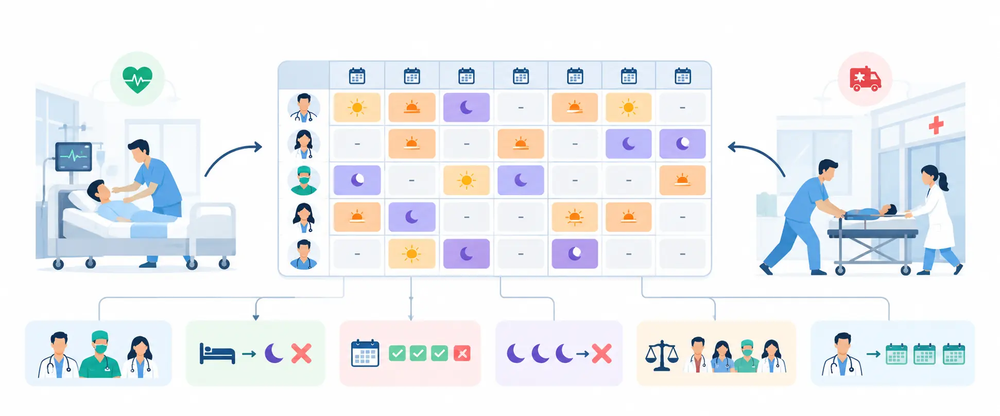
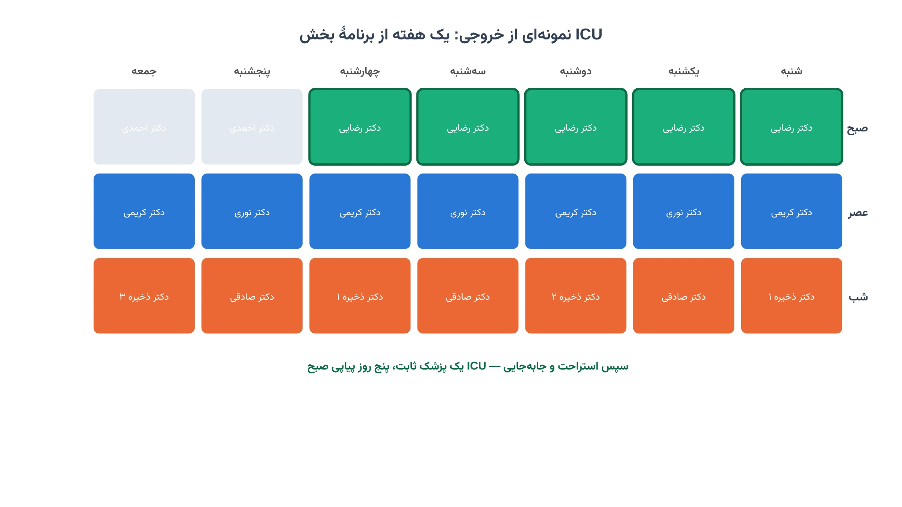
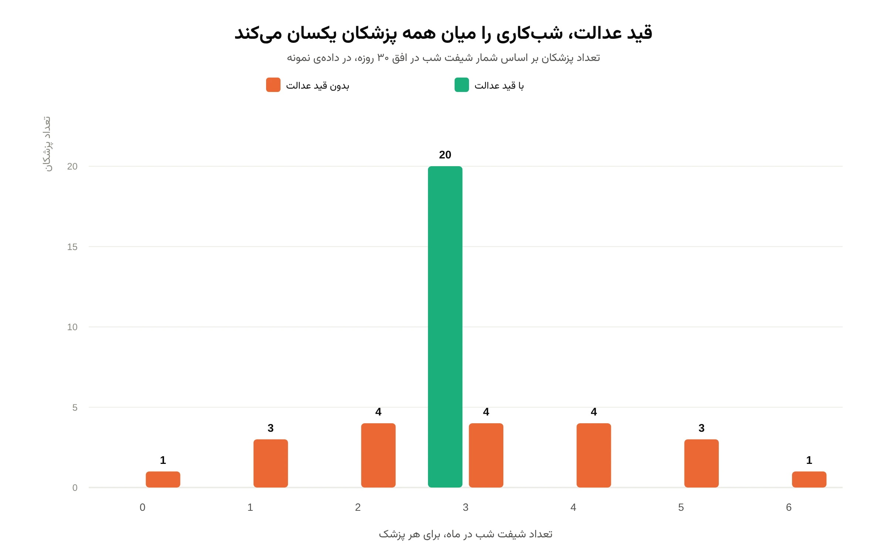
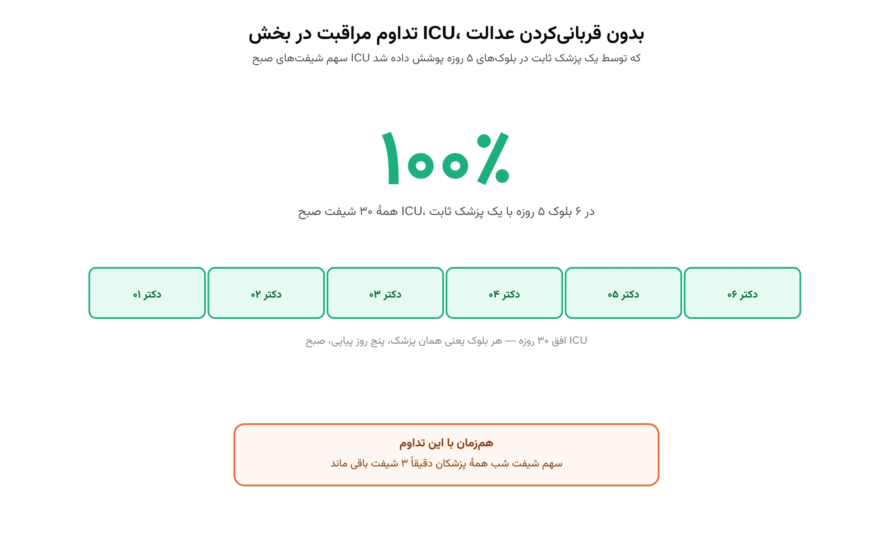

## 📋 معرفی پروژه

**هدف:** طراحی یک مدل تصمیم‌گیری برای زمان‌بندی شیفت پزشکان و دستیاران پزشک بیمارستان شما که:

- ✅ پوشش دقیق هر شیفت را در هر بخش (ICU، اورژانس، بخش عمومی) تضمین کند
- ✅ قانون استراحت پس از شب‌کاری و سقف روزهای کاری هفتگی هر نفر را رعایت کند
- ✅ پزشکان ذخیره (پاره‌وقت) را با قوانین مخصوص خودشان در برنامه بگنجاند
- ✅ شیفت‌های شب را میان همه‌ی پزشکان عادلانه توزیع کند
- ✅ تا حد ممکن، مراقبت از بیماران بخش ویژه را به یک پزشک ثابت در چند روز پیاپی بسپارد

اگر با مبانی مدل‌سازی ریاضی این‌گونه مسائل زمان‌بندی آشنا نیستید، دوره
[مدل‌سازی مسائل بهینه‌سازی](/courses/optimization-modeling/) پیش‌زمینه‌ی خوبی می‌دهد.

نمونه‌ای مشابه از همین رویکرد زمان‌بندی، در یادداشت
[زمان‌بندی شیفت کارکنان با CP-SAT](/notes/employee-shift-scheduling-cp-sat/) قابل مشاهده است.

تصویر بالا تفاوت دو نوع پزشک را نشان می‌دهد. پزشک ثابت حداکثر پنج روز از هر هفت روز کار می‌کند و از قانون
استراحت پس از شب‌کاری پیروی می‌کند. پزشک ذخیره فقط شیفت عصر یا شب می‌گیرد، اما باید حداقل یک شیفت در هفته
داشته باشد تا در دسترس بماند.

زمان‌بندی شیفت بیمارستان یکی از سخت‌ترین مسائل تخصیص منابع انسانی است. هر بخش، هر شیفت و هر نوع نیرو قانون
خودش را دارد. یک پزشک نباید بعد از شیفت شب، صبح روز بعد هم سر کار باشد. هیچ‌کس نباید بیش از حد مجاز پشت‌سرهم
شب کار کند. و در عین حال، بیمار بخش ویژه باید تا حد امکان توسط یک پزشک آشنا به پرونده‌اش مراقبت شود، نه هر روز
یک نفر تازه. مدل این پروژه دقیقاً همین تعادل را پیدا می‌کند؛ با یک سالور ریاضی، نه با حدس و آزمایش دستی.

---

## 🧩 ابعاد و قیودی که مدل برای شما در نظر می‌گیرد

زمان‌بندی شیفت پزشکی فقط «پر کردن جدول» نیست. مدل این پروژه هم‌زمان به همه‌ی این ابعاد واقعی بیمارستان شما
پایبند می‌ماند:

- **پوشش دقیق هر شیفت به تفکیک بخش و نقش:** هر شیفت صبح، عصر و شب در ICU، اورژانس و بخش عمومی، دقیقاً به
  تعداد لازم پزشک و دستیار پزشک پر می‌شود، نه کمتر و نه بیشتر
- **دو نوع نیرو با سقف جداگانه:** پزشک و دستیار پزشک هر کدام نیاز شیفتی مستقل خودشان را دارند
- **قانون استراحت پس از شب‌کاری:** هیچ‌کس بعد از شیفت شب، صبح روز بعد را کار نمی‌کند
- **سقف پنج روز کاری از هر هفت روز:** برای هر نفر، در هر بازه‌ی هفت‌روزه‌ی متحرک، نه فقط هفته‌های تقویمی
- **سقف سه شب پشت‌سرهم:** هیچ پزشکی بیش از سه شب متوالی در یک بازه‌ی چهارروزه شیفت شب نمی‌گیرد
- **قوانین مخصوص پزشکان ذخیره:** فقط شیفت عصر یا شب، و حداقل یک شیفت در هر هفته تا در دسترس بمانند
- **سقف عدالت‌محور شیفت شب:** مدل می‌تواند بیشینه‌ی شیفت شب هر نفر را محدود کند تا فشار شب‌کاری میان همه
  پخش شود، نه روی چند نفر ثابت
- **تداوم مراقبت در ICU:** امتیاز اضافه برای برنامه‌هایی که شیفت صبح ICU را پنج روز پیاپی به یک پزشک ثابت
  می‌سپارند

نتیجه، یک برنامه‌ی واحد است که همه‌ی این قیدها را با هم رعایت می‌کند. نه یک برنامه‌ی خوب برای یک بخش،
که بقیه‌ی بیمارستان را نادیده بگیرد.

---

## 🎯 ۶ تحویل پروژه

### **تحویل ۱: فرمول‌بندی مسئله و ساختار داده‌ی بیمارستان شما**

**اهداف:**

- ثبت دقیق بخش‌ها، شیفت‌ها (صبح/عصر/شب) و نیاز نیروی هر شیفت به تفکیک پزشک و دستیار پزشک
- ثبت فهرست پزشکان ثابت، پزشکان ذخیره و دستیاران پزشک، همراه مهارت‌ها و محدودیت‌های هر نفر
- تعریف دقیق قانون استراحت، سقف روزهای کاری هفتگی و سقف شب‌های پشت‌سرهم، مطابق آیین‌نامه‌ی بیمارستان شما

**تحویل به شما:**

- گزارش مدل‌سازی مسئله، متناسب با بخش‌ها و نیروهای واقعی بیمارستان شما
- فایل ساختاریافته‌ی داده‌ی ورودی (قابل تکمیل از فایل اکسل روستر فعلی شما)

---

### **تحویل ۲: مدل بهینه‌سازی پوشش شیفت و قوانین استراحت (OR-Tools CP-SAT)**

**اهداف:**

- پیاده‌سازی قید پوشش دقیق هر شیفت برای پزشک و دستیار پزشک، به‌طور جداگانه
- اعمال قانون استراحت پس از شب‌کاری و سقف پنج روز کاری در هر بازه‌ی هفت‌روزه‌ی متحرک
- اعمال قوانین مخصوص پزشکان ذخیره: فقط عصر/شب، حداقل یک شیفت در هفته
- حل مدل با سالور CP-SAT گوگل و استخراج برنامه‌ی کامل شیفت

**تحویل به شما:**

- برنامه‌ی شیفت کامل برای افق زمانی مورد نظر شما (مثلاً یک ماه)
- گزارش رعایت تمام قیدهای پوشش و استراحت، برای هر نفر و هر شیفت

---

### **تحویل ۳: عدالت در توزیع شیفت شب**

**اهداف:**

- اندازه‌گیری شمار شیفت شب هر پزشک در افق زمانی برنامه
- اضافه‌کردن قید سقف شیفت شب به ازای هر نفر و کمینه‌کردن بیشینه‌ی این سقف میان کل پزشکان
- مقایسه‌ی توزیع شیفت شب پیش و پس از اعمال این قید

**تحویل به شما:**

- نمودار توزیع شیفت شب، پیش و پس از قید عدالت
- تضمین این‌که هیچ پزشکی نسبت به دیگران، بار شب‌کاری نامتناسبی نمی‌کشد

---

### **تحویل ۴: تداوم مراقبت در بخش ویژه (ICU)**

**اهداف:**

- تعریف پاداش برای برنامه‌هایی که شیفت صبح ICU را در بلوک‌های پنج‌روزه به یک پزشک ثابت می‌سپارند
- بیشینه‌کردن همزمان این پاداش، در کنار تمام قیدهای پوشش، استراحت و عدالت
- بررسی این‌که آیا تداوم مراقبت و عدالت در شیفت شب، هر دو هم‌زمان قابل دستیابی‌اند یا باید یکی فدای دیگری شود

**تحویل به شما:**

- گزارش درصد پوشش شیفت‌های صبح ICU توسط بلوک‌های پزشک ثابت پنج‌روزه
- در نمونه‌ی آزمایشی ما، مدل توانست تداوم مراقبت کامل در ICU و عدالت کامل در شیفت شب را هم‌زمان، بدون هیچ
  مصالحه‌ای، به دست آورد

---

### **تحویل ۵: تحلیل حساسیت و شناسایی گلوگاه واقعی نیروی انسانی**

**اهداف:**

- بررسی اثر کاهش تعداد پزشکان ثابت یا ذخیره روی امکان‌پذیری کامل برنامه
- بررسی اثر سخت‌گیرتر کردن سقف عدالت شیفت شب روی امکان‌پذیری و کیفیت تداوم مراقبت
- تعیین این‌که کدام بخش یا کدام نوع نیرو، در شرایط فعلی شما، محدودکننده‌ی واقعی برنامه است

**تحویل به شما:**

- گزارش حساسیت نتیجه به تعداد نیرو در هر نقش و هر بخش
- تشخیص دقیق گلوگاه کمبود نیرو، پیش از آنکه برنامه در عمل با کمبود واقعی روبه‌رو شود

---

### **تحویل ۶: خروجی نهایی و گزارش قابل‌ارائه**

**اهداف:**

- تولید برنامه‌ی شیفت نهایی به شکل قابل‌توزیع میان پزشکان و دستیاران
- جمع‌بندی گزارش عدالت، تداوم مراقبت و رعایت تمام قوانین استراحت برای ارائه به مدیریت بیمارستان

**تحویل به شما:**

- فایل برنامه‌ی شیفت نهایی، آماده‌ی توزیع
- گزارش نهایی قابل‌ارائه به مدیریت، همراه با کد کامل و فایل‌های داده و نتایج

---

## 📊 نتایج انتظاری

پس از این پروژه، در اختیار شما قرار می‌گیرد:

✅ برنامه‌ی شیفت کامل پزشکان و دستیاران، با پوشش دقیق هر شیفت در هر بخش
✅ رعایت تضمین‌شده‌ی قانون استراحت، سقف روزهای کاری و سقف شب‌های پشت‌سرهم
✅ توزیع عادلانه‌ی شیفت شب میان همه‌ی پزشکان
✅ حداکثر تداوم ممکن مراقبت از بیماران بخش ویژه، بدون قربانی‌کردن عدالت
✅ گزارش و کد کامل، قابل اجرا روی روستر واقعی بیمارستان شما در دوره‌های بعدی برنامه‌ریزی

### نمونه‌ای از خروجی روی داده‌ی آزمایشی

برای این‌که شکل واقعی خروجی را از پیش ببینید، مدل را روی یک داده‌ی آزمایشی اجرا کرده‌ایم: ۲۰ پزشک (۱۴ ثابت و
۶ ذخیره) و ۱۰ دستیار پزشک، برای افق ۳۰ روزه. اعداد زیر مربوط به همین نمونه‌ی آزمایشی‌اند، نه بیمارستان خاصی.

این تصویر یک هفته از برنامه‌ی ICU را نشان می‌دهد. شیفت صبح پنج روز پیاپی به یک پزشک ثابت سپرده شده، سپس
استراحت و جابه‌جایی به پزشک بعدی. شیفت‌های عصر و شب میان چند نفر دیگر، با رعایت کامل قانون استراحت، چرخش
می‌کند.

بدون قید عدالت، تعداد شیفت شب هر پزشک در این نمونه بین ۰ تا ۶ پراکنده بود. برخی پزشکان تقریباً شب کار
نمی‌کردند؛ برخی دیگر فشار سنگینی می‌کشیدند. با افزودن قید سقف شیفت شب، تمام ۲۰ پزشک دقیقاً به ۳ شیفت شب
رسیدند؛ توزیعی کاملاً یکسان.

نکته‌ی مهم‌تر این است که این عدالت کامل، هیچ هزینه‌ای برای تداوم مراقبت نداشت. در همین نمونه، مدل توانست همه‌ی ۳۰ شیفت صبح ICU را در ۶ بلوک پنج‌روزه با یک پزشک ثابت پوشش دهد. یعنی
۱۰۰٪ تداوم مراقبت، هم‌زمان با توزیع کاملاً عادلانه‌ی شیفت شب. این دقیقاً همان نوع یافته‌ای است که نشان می‌دهد چند هدف به‌ظاهر متضاد، با
مدل‌سازی درست، می‌توانند هم‌زمان برآورده شوند.

---

## 📁 فایل‌های پروژه

| تحویل | فایل                                   | توضیح                                           |
|-------|------------------------------------------|---------------------------------------------------|
| ۱     | `problem_setup.py` + `roster_template.xlsx` | ساختار مسئله و قالب داده‌ی ورودی بیمارستان شما     |
| ۲     | `coverage_rest_model.py`                 | مدل پوشش شیفت و قوانین استراحت (CP-SAT)             |
| ۳     | `fairness_constraint.py`                 | قید و تحلیل عدالت در توزیع شیفت شب                 |
| ۴     | `continuity_objective.py`                | هدف تداوم مراقبت در ICU                             |
| ۵     | `sensitivity_analysis.py`                | تحلیل حساسیت نیروی انسانی                           |
| ۶     | `final_schedule.xlsx` + `final_report.pdf` | برنامه‌ی نهایی شیفت و گزارش قابل‌ارائه             |

---

## 🚀 شروع کار

برای شروع، کافی است فهرست بخش‌ها، نیازهای شیفتی، پزشکان و دستیاران پزشک بیمارستان خود را در اختیار ما
بگذارید. قالب داده‌ی اکسل تحویل ۱ دقیقاً برای همین منظور طراحی شده است، تا جمع‌آوری اطلاعات روستر شما ساده و
سریع باشد.

اگر مایلید پیش از شروع همکاری منطق مدل را دقیق‌تر بشناسید، یادداشت
[راهنمای زمان‌بندی با CP-SAT](/notes/cpsat-scheduling-guide/) تصویر خوبی از توان این نوع مدل‌سازی می‌دهد.
نمونه‌ی مشابهی از زمان‌بندی شیفت کارکنان با قیود استراحت و عدالت، در یادداشت
[زمان‌بندی شیفت کارکنان فروشگاه با CP-SAT](/notes/retail-staff-scheduling-cp-sat/) هم قابل مشاهده است. برای
درک عمیق‌تر مبانی مدل‌سازی بهینه‌سازی پیش از شروع همکاری، دوره
[مدل‌سازی مسائل بهینه‌سازی](/courses/optimization-modeling/) چارچوب مناسبی ارائه می‌دهد.

## سوالات متداول

<h3>آیا لازم است روستر دقیق پزشکان خود را از همین حالا آماده کنم؟</h3>

نه؛ ما قالب داده‌ی ورودی را در اختیار شما می‌گذاریم. در تکمیل آن، با توجه به بخش‌ها و نیروهای واقعی بیمارستان شما همراهی می‌کنیم.

<h3>اگر تعداد پزشکان ما برای رعایت همه‌ی قوانین کافی نباشد، چه می‌شود؟</h3>

در این حالت مدل به‌جای یک برنامه‌ی نادرست، صریحاً اعلام می‌کند کدام قید یا کدام بخش مانع تکمیل برنامه است. همین تشخیص به شما کمک می‌کند تصمیم بگیرید نیروی کدام بخش را تقویت کنید.

<h3>برای اجرای این مدل روی روستر واقعی بیمارستان خودمان چه کار کنم؟</h3>

می‌توانید از طریق صفحه <a href="/consultation/" style="color:#2563EB; font-weight:bold;">مشاوره</a> با ما در ارتباط باشید تا جزئیات بخش‌ها، نیروها و قوانین بیمارستان شما را بررسی کنیم.

