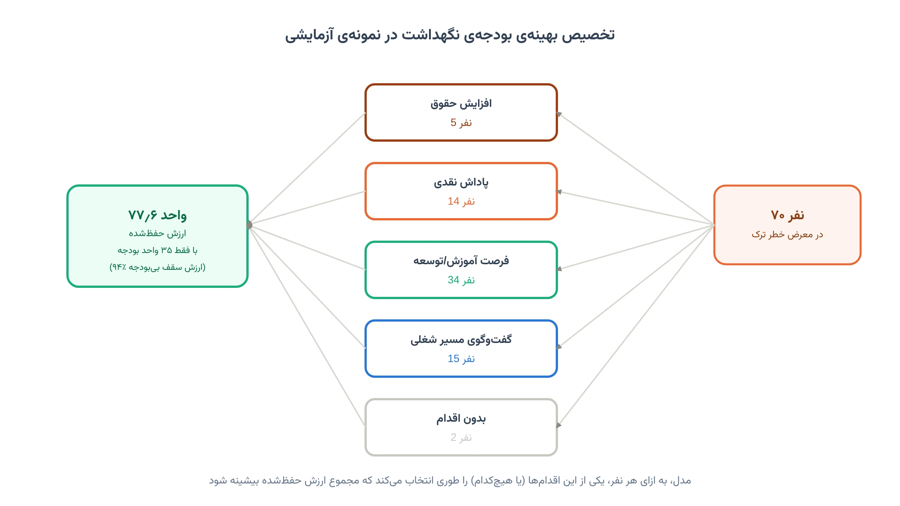
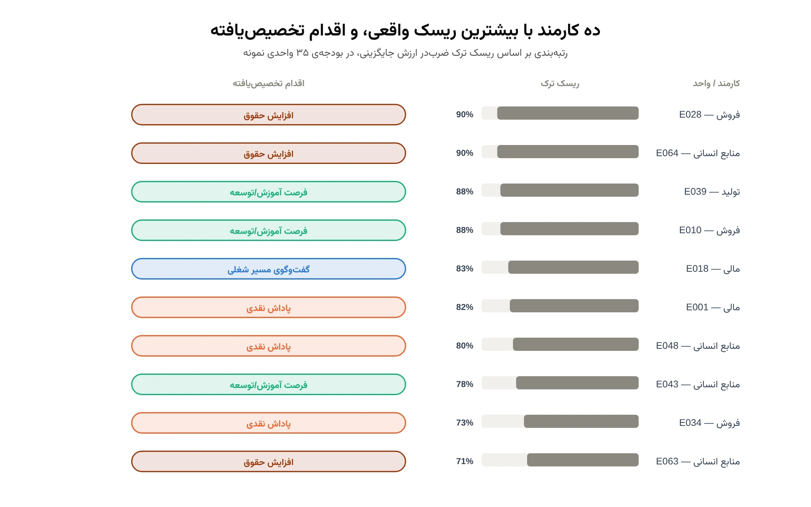
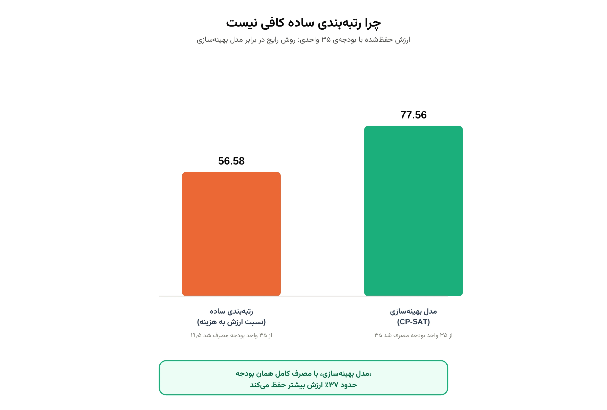
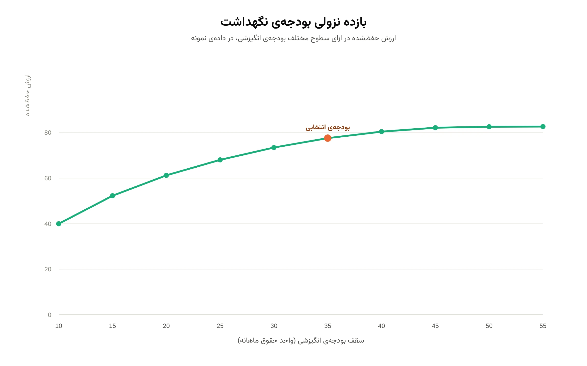

## 📋 معرفی پروژه

**هدف:** طراحی یک مدل تصمیم‌گیری برای واحد منابع انسانی سازمان شما که:

- ✅ کارکنان واقعاً در معرض خطر ترک سازمان را، با برآورد ریسک و هزینه‌ی جایگزینی هرکدام، شناسایی کند
- ✅ برای هر نفر، مناسب‌ترین اقدام نگهداشت را از میان چند گزینه (افزایش حقوق، پاداش، آموزش و توسعه، گفت‌وگوی مسیر شغلی) انتخاب کند
- ✅ همه‌ی این تصمیم‌ها را هم‌زمان در سقف بودجه‌ی انگیزشی شما نگه دارد
- ✅ تضمین کند افراد با بالاترین ریسک واقعی، هیچ‌وقت بدون هیچ اقدامی باقی نمانند
- ✅ نشان دهد با افزایش یا کاهش بودجه، چقدر ارزش بیشتر یا کمتری حفظ می‌شود

اگر با مبانی مدل‌سازی ریاضی این‌گونه مسائل تخصیص بودجه آشنا نیستید، دوره
[مدل‌سازی مسائل بهینه‌سازی](/courses/optimization-modeling/) پیش‌زمینه‌ی خوبی می‌دهد.

تصویر بالا منطق اصلی کار را نشان می‌دهد. هر کارمند در معرض خطر، یکی از چند اقدام ممکن را دریافت می‌کند یا اصلاً
اقدامی روی او انجام نمی‌شود. مدل این انتخاب‌ها را طوری می‌چیند که مجموع ارزش حفظ‌شده، در سقف بودجه‌ی تعیین‌شده،
بیشینه شود.

هر سازمانی که با ترک نیروی کلیدی روبه‌رو می‌شود، معمولاً یکی از دو راه را می‌رود. یا بودجه‌ی نگهداشت را
به‌صورت یکسان میان همه پخش می‌کند. یا بر اساس رتبه‌بندی ساده‌ی ریسک، نفر به نفر خرج می‌کند تا بودجه تمام
شود. هر دو روش، بخشی از ارزش واقعی قابل‌حفظ را از دست می‌دهند. تصمیم درست، هزینه و اثر هر اقدام را برای هر
فرد جداگانه می‌سنجد. بودجه را جایی خرج می‌کند که بیشترین بازده را دارد.

---

## 🧩 ابعاد و قیودی که مدل برای شما در نظر می‌گیرد

این مسئله به ظاهر ساده است: به چند نفر خاص، پاداش یا افزایش حقوق بدهید. اما تصمیم درست باید هم‌زمان به چند بعد
واقعی سازمان شما پایبند بماند. مدل این پروژه دقیقاً همین ابعاد را، همه با هم و نه یکی‌یکی، در نظر می‌گیرد:

- **ریسک و ارزش جایگزینی متفاوت هر نفر:** هر کارمند احتمال ترک و هزینه‌ی جایگزینی مخصوص به خودش را دارد
- **چند گزینه‌ی اقدام با هزینه و اثر متفاوت:** افزایش حقوق، پاداش نقدی، آموزش و توسعه و گفت‌وگوی مسیر شغلی،
  هرکدام هزینه‌ی خودشان را دارند و اثرشان روی هر نفر یکسان نیست
- **یک سقف بودجه‌ی واحد:** مجموع هزینه‌ی همه‌ی اقدام‌های انتخاب‌شده نباید از بودجه‌ی انگیزشی شما فراتر برود
- **یک اقدام برای هر نفر:** هر کارمند حداکثر یک نوع اقدام نگهداشت دریافت می‌کند، نه ترکیبی از چند مورد
- **پوشش تضمینی بالاترین ریسک‌ها:** کارکنانی که بیشترین ریسک و ارزش جایگزینی را دارند، همیشه حداقل یک اقدام
  دریافت می‌کنند، حتی اگر از نظر بازده خالص گزینه‌ی برتر نباشند
- **بازده نزولی بودجه:** مدل نشان می‌دهد از چه نقطه‌ای به بعد، بودجه‌ی اضافه دیگر ارزش قابل‌توجهی اضافه نمی‌کند

نتیجه، یک تصمیم واحد است که همه‌ی این قیدها را با هم رعایت می‌کند. نه یک تصمیم خوب برای چند نفر خاص،
که باقی سازمان را نادیده بگیرد.

---

## 🎯 ۵ تحویل پروژه

### **تحویل ۱: فرمول‌بندی مسئله و ساختار داده‌ی سازمان شما**

**اهداف:**

- ثبت فهرست کارکنان در معرض خطر، همراه برآورد ریسک ترک و هزینه‌ی جایگزینی هرکدام
- تعریف گزینه‌های اقدام نگهداشت قابل‌اجرا در سازمان شما و هزینه‌ی هرکدام
- تعیین دقیق سقف بودجه‌ی انگیزشی و هر محدودیت سیاستی دیگر (مثل پوشش تضمینی بالاترین ریسک‌ها)

**تحویل به شما:**

- گزارش مدل‌سازی مسئله، متناسب با داده‌ی واقعی منابع انسانی سازمان شما
- فایل ساختاریافته‌ی داده‌ی ورودی (قابل تکمیل از فایل اکسل شما)

---

### **تحویل ۲: برآورد اثر هر اقدام روی هر کارمند**

**اهداف:**

- محاسبه‌ی میزان کاهش ریسک ترک، به ازای هر اقدام ممکن، برای هر کارمند
- محاسبه‌ی ارزش خالص هر گزینه: کاهش ریسک ضرب‌در ارزش جایگزینی، منهای هزینه‌ی همان اقدام
- حذف خودکار گزینه‌هایی که ارزش خالص منفی دارند

**تحویل به شما:**

- جدول کامل ارزش خالص هر ترکیب کارمند/اقدام
- رتبه‌بندی اولیه‌ی کارکنان بر اساس ریسک ضرب‌در ارزش جایگزینی

---

### **تحویل ۳: مدل بهینه‌سازی تخصیص بودجه (OR-Tools CP-SAT)**

**اهداف:**

- پیاده‌سازی مدل ریاضی تخصیص: هر کارمند حداکثر یک اقدام، در سقف بودجه‌ی کل
- اعمال قید پوشش تضمینی برای بالاترین ریسک‌ها
- حل مدل با سالور CP-SAT گوگل و استخراج فهرست نهایی اقدام‌ها

**تحویل به شما:**

- فهرست نهایی: برای هر کارمند، کدام اقدام (یا بدون اقدام) با چه هزینه‌ای
- در نمونه‌ی آزمایشی ما، همین مدل با ۳۵ واحد بودجه، حدود ۹۴٪ از ارزش قابل‌حفظ در حالت بی‌بودجه را به دست آورد

---

### **تحویل ۴: مقایسه با روش رتبه‌بندی ساده**

**اهداف:**

- حل همان مسئله با یک روش رایج و ساده: رتبه‌بندی بر اساس نسبت ارزش به هزینه و تخصیص تا پایان بودجه
- مقایسه‌ی ارزش حفظ‌شده‌ی دو روش، با مصرف دقیقاً همان سقف بودجه

**تحویل به شما:**

- گزارش مقایسه‌ای: مدل بهینه در برابر رتبه‌بندی ساده
- در نمونه‌ی آزمایشی ما، روش رتبه‌بندی ساده حتی کل بودجه را هم مصرف نکرد و فقط ۵۶٫۶ واحد ارزش حفظ کرد؛ مدل
  بهینه با مصرف کامل همان بودجه به ۷۷٫۶ واحد رسید؛ حدود ۳۷٪ ارزش بیشتر

---

### **تحویل ۵: تحلیل حساسیت بودجه و گزارش نهایی**

**اهداف:**

- بررسی ارزش حفظ‌شده در چند سطح مختلف بودجه، از محدود تا کاملاً آزاد
- شناسایی نقطه‌ای که افزایش بودجه دیگر ارزش قابل‌توجهی اضافه نمی‌کند
- جمع‌بندی یافته‌ها و توصیه‌ی سطح بودجه‌ی پیشنهادی برای سازمان شما

**تحویل به شما:**

- نمودار و جدول حساسیت ارزش حفظ‌شده به سطح بودجه
- گزارش نهایی قابل‌ارائه به مدیریت، همراه با کد کامل و فایل‌های داده و نتایج

---

## 📊 نتایج انتظاری

پس از این پروژه، در اختیار شما قرار می‌گیرد:

✅ فهرست نهایی اقدام نگهداشت برای هر کارمند در معرض خطر، در سقف بودجه‌ی شما
✅ تضمین پوشش بالاترین ریسک‌های واقعی سازمان
✅ مقایسه‌ی روشن بین تصمیم بهینه و روش رتبه‌بندی ساده‌ی رایج
✅ نمودار حساسیت ارزش حفظ‌شده به سطح بودجه، برای تصمیم‌گیری درباره‌ی بودجه‌ی سال آینده
✅ گزارش و کد کامل، قابل اجرا روی داده‌ی واقعی سازمان شما در دوره‌های بعدی

### نمونه‌ای از خروجی روی داده‌ی آزمایشی

برای این‌که شکل واقعی خروجی را از پیش ببینید، مدل را روی یک داده‌ی آزمایشی اجرا کرده‌ایم. این داده شامل ۷۰
کارمند در معرض خطر ترک، در پنج واحد سازمانی است. اعداد زیر مربوط به همین نمونه‌ی آزمایشی‌اند، نه سازمان خاصی.

این نمودار دقیقاً همان خروجی‌ای است که تحویل ۳ در اختیار شما می‌گذارد. نه یک عدد کلی، که فهرست دقیق هر نفر و
اقدام متناسب با او. در این نمونه، دو نفر با بالاترین ریسک، افزایش حقوق گرفتند. چند نفر دیگر با هزینه‌ی کمتر،
از طریق آموزش یا گفت‌وگوی مسیر شغلی حفظ شدند.

این مقایسه نشان می‌دهد چرا رتبه‌بندی ساده، با وجود منطقی‌به‌نظر رسیدن، بودجه را به‌خوبی خرج نمی‌کند. در این
نمونه، روش ساده حتی نتوانست کل بودجه را مصرف کند. تصمیم‌های تکی را کنار هم می‌گذارد، نه در کنار هم. مدل
بهینه، با همان بودجه، ترکیب درست‌تری از افراد و اقدام‌ها را پیدا می‌کند.

این نمودار حساسیت نشان می‌دهد ارزش حفظ‌شده در سطوح مختلف بودجه چطور تغییر می‌کند. در نمونه‌ی ما، افزایش بودجه
از ۱۰ به ۳۵ واحد، ارزش حفظ‌شده را تقریباً دو برابر کرد. اما از حدود ۴۵ واحد به بعد، منحنی تقریباً صاف می‌شود؛
بودجه‌ی اضافه دیگر تاثیر چندانی ندارد. این یافته دقیقاً همان چیزی است که به شما کمک می‌کند. بودجه‌ی نگهداشت
سال آینده را روی عدد درست تثبیت کنید، نه این‌که حدس بزنید.

---

## 📁 فایل‌های پروژه

| تحویل | فایل                                   | توضیح                                           |
|-------|------------------------------------------|---------------------------------------------------|
| ۱     | `problem_setup.py` + `risk_data_template.xlsx` | ساختار مسئله و قالب داده‌ی ورودی سازمان شما    |
| ۲     | `action_value_estimation.py`             | برآورد ارزش خالص هر ترکیب کارمند/اقدام             |
| ۳     | `budget_allocation_model.py`             | مدل بهینه‌سازی تخصیص بودجه (CP-SAT)                |
| ۴     | `greedy_baseline_comparison.py`          | مقایسه با روش رتبه‌بندی ساده                       |
| ۵     | `budget_sensitivity.py` + `final_report.pdf` | تحلیل حساسیت بودجه و گزارش نهایی               |

---

## 🚀 شروع کار

برای شروع، کافی است فهرست کارکنان در معرض خطر و سقف بودجه‌ی انگیزشی خود را در اختیار ما بگذارید؛ برآورد
ریسک یا شاخص‌های مرتبط با آن را هم اگر دارید اضافه کنید. قالب داده‌ی اکسل تحویل ۱ دقیقاً برای همین منظور
طراحی شده است. همین قالب، جمع‌آوری اطلاعات سازمان شما را ساده و سریع می‌کند.

اگر مایلید پیش از شروع همکاری منطق مدل را دقیق‌تر بشناسید، یادداشت
[راهنمای زمان‌بندی با CP-SAT](/notes/cpsat-scheduling-guide/) را ببینید. این یادداشت تصویر خوبی از توان این
نوع مدل‌سازی تخصیص می‌دهد. گاهی بودجه یا سیاست‌های سازمان به‌قدری محدود است که مدل اصلاً جوابی پیدا نمی‌کند. یادداشت
[تشخیص مدل غیرشدنی](/notes/infeasible-model-diagnosis/) توضیح می‌دهد چرا چنین چیزی رخ می‌دهد و چطور تفسیرش
کنیم.

## سوالات متداول

<h3>آیا لازم است برآورد ریسک ترک کارکنان را از قبل آماده کنم؟</h3>

نه؛ اگر چنین برآوردی ندارید، در تعریف یک شاخص ساده کمکتان می‌کنیم. این شاخص را بر اساس داده‌های موجود سازمان شما، مثل سابقه، رضایت‌سنجی یا غیبت، می‌سازیم.

<h3>اگر بودجه‌ی ما به‌قدری محدود باشد که نتواند حتی بالاترین ریسک‌ها را پوشش دهد، چه می‌شود؟</h3>

در این حالت مدل به‌جای یک پاسخ نادرست، صریحاً اعلام می‌کند این محدودیت کجا رخ می‌دهد. همین تشخیص به شما کمک می‌کند تصمیم بگیرید بودجه را افزایش دهید یا اولویت‌ها را بازبینی کنید.

<h3>برای اجرای این مدل روی داده‌ی واقعی کارکنان سازمان خودم چه کار کنم؟</h3>

می‌توانید از طریق صفحه <a href="/consultation/" style="color:#2563EB; font-weight:bold;">مشاوره</a> با ما در ارتباط باشید تا جزئیات کارکنان، ریسک‌ها و بودجه‌ی سازمان شما را بررسی کنیم.

