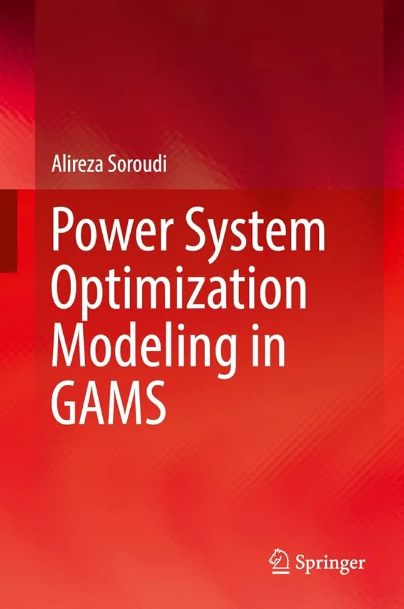

بسیاری از مسائل بهینه‌سازی سیستم قدرت — از پخش بار اقتصادی گرفته تا آرایش بهینه‌ی واحدها و توسعه‌ی شبکه — نیازمند ابزاری هستند که هم به زبان ریاضی نزدیک باشد و هم برای حل مسائل بزرگ‌مقیاس کارآمد. **GAMS** (General Algebraic Modeling System) دقیقاً همین نقش را ایفا می‌کند و کتاب *Power System Optimization Modeling in GAMS* اثر دکتر علیرضا سرودی، یکی از جامع‌ترین مرجع‌ها برای یادگیری این رویکرد است. اگر با مبانی مدل‌سازی ریاضی مسائل بهینه‌سازی آشنا نیستید، دوره [مدل‌سازی مسائل بهینه‌سازی](/courses/optimization-modeling/) نقطه شروع خوبی پیش از ورود به GAMS است.

## چرا این کتاب و کتابخانه اهمیت دارند؟

- **مرجع کامل و کاربردی:** برخلاف بسیاری از منابع نظری، این کتاب برای هر مسئله، کد حل‌شده و آماده در GAMS ارائه می‌دهد.
- **پوشش گسترده:** از مسائل پایه‌ی سیستم قدرت تا مدل‌های پیشرفته‌ی برنامه‌ریزی و بهره‌برداری.
- **ترکیب تئوری و عمل:** هر فصل شامل مبانی نظری، مثال‌های کاربردی و مطالعات موردی واقعی است.
- **کتابخانه‌ی آنلاین (PSOPTLIB):** مجموعه‌ای از ۳۲ مدل آماده که می‌توان مستقیماً در پروژه‌های پژوهشی یا صنعتی استفاده کرد.

## درباره‌ی کتابخانه‌ی PSOPTLIB

کتابخانه‌ی PSOPTLIB فهرستی از مدل‌های موجود در کنار این کتاب است و شامل ۳۲ مدل از حوزه‌های مختلف بهینه‌سازی سیستم قدرت می‌شود؛ همگی به زبان GAMS پیاده‌سازی شده‌اند. هدف این کتابخانه، فراهم کردن نقطه‌ی شروعی سریع و قابل‌اعتماد برای کسانی است که می‌خواهند مسائل بهره‌برداری و برنامه‌ریزی شبکه‌ی قدرت را با استفاده از GAMS مدل و حل کنند. برخی از این مدل‌ها به‌طور مستقیم به عدم‌قطعیت پارامترها (مثل تقاضا یا تولید تجدیدپذیر) می‌پردازند؛ برای مرور مبانی این رویکردها، دوره [مدل‌سازی عدم‌قطعیت](/courses/uncertainty-modeling/) منبع خوبی است.

می‌توانید فهرست کامل مدل‌ها را در وب‌سایت رسمی GAMS مشاهده کنید:
<a href="https://www.gams.com/latest/psoptlib_ml/libhtml/index.html" class="content-link">کتابخانه‌ی PSOPTLIB</a>
## یک نمونه کد در GAMS

برای مثال، یک مدل ساده‌ی پخش بار اقتصادی می‌تواند به این شکل در GAMS تعریف شود:

```gams
Variables
    P1, P2, Cost;

Equations
    obj, balance;

obj..      Cost =e= 10*P1 + 15*P2;
balance..  P1 + P2 =e= 100;

P1.up = 80;
P2.up = 80;

Model dispatch /all/;
Solve dispatch using lp minimizing Cost;
```

## این منبع برای چه کسانی مناسب است؟

- متخصصان صنعت برق و سیستم قدرت
- پژوهشگران و توسعه‌دهندگان حوزه‌ی انرژی
- جامعه‌ی مهندسی برق قدرت
- دانشجویان کارشناسی و تحصیلات تکمیلی

> یک مدل ساده که درست کار می‌کند، همیشه ارزشمندتر از مدلی پیچیده است که هرگز به جواب نمی‌رسد.

<p> اگر اکسپایر شدن مکرر لایسنس گمز شما رو اذیت میکنه و می خوایید مشکل رو به صورت ریشه ای حل کنید در دوره <a href="/courses/advanced-power-system/" style="color:#2563EB; font-weight:bold;">سیستم قدرت پیشرفته</a> این مفاهیم از پایه و با مثال‌های عملی روی پایتون آموزش داده می‌شوند.</p>
